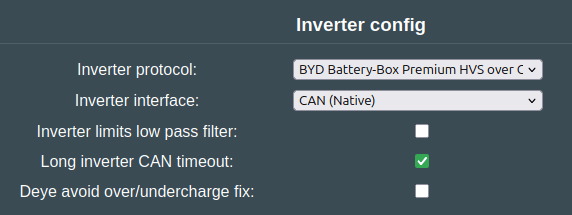
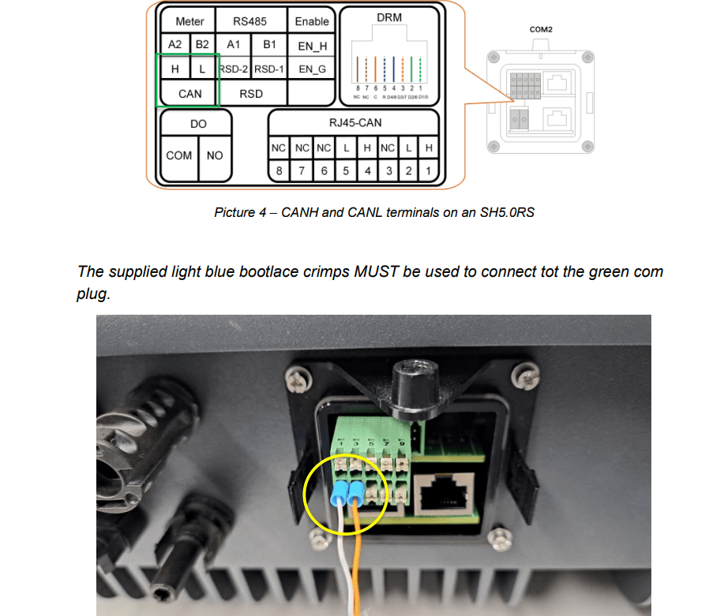
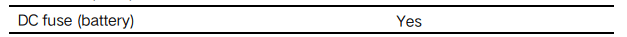
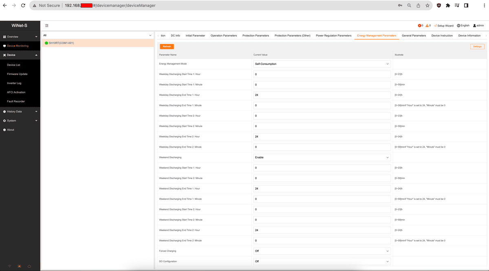
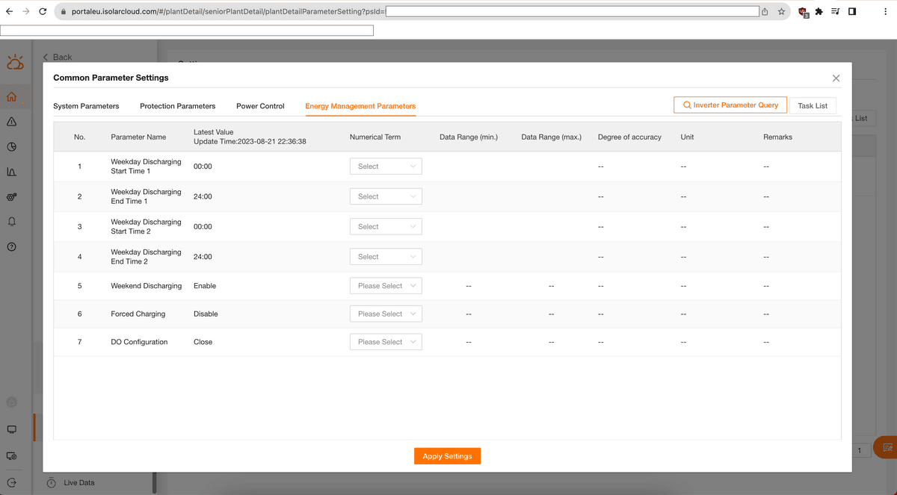
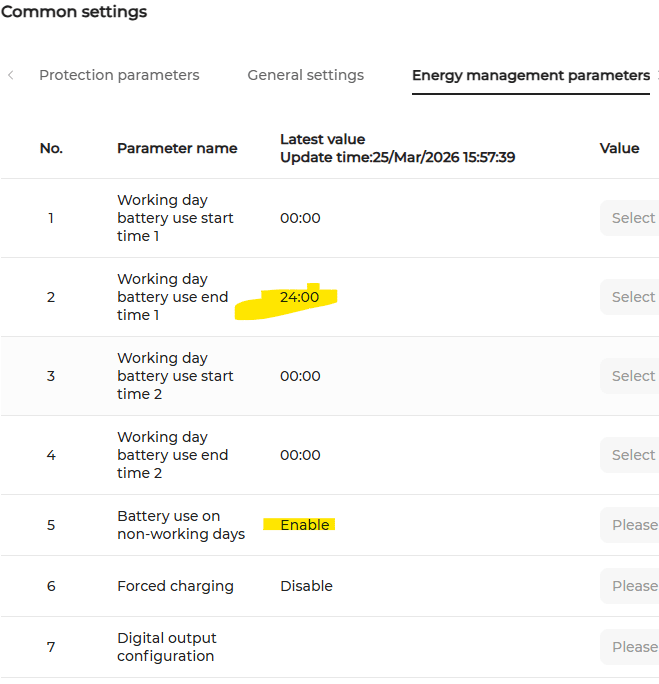

## Compatible Inverters

| Model | BYD CAN | Sungrow SBRXXX CAN | Notes |
|-------|---------|--------------------|-------|
| SH5.0/6.0/8.0/10RT | ✅ | ✅ | |
| SH3.0/3.6/4.0/5.0/6.0RS | ✅ | ✅ | |
| SH3.0/3.6/4.0/5.0/6.0RS (Australia) | ❌ | ✅ | Not BYD compatible. [Old firmware](https://github.com/dalathegreat/Battery-Emulator/issues/670#issuecomment-2546911926) may work with BYD |
| SH8.0RS/SH10RS (Australia) | ❌ | ✅ | Not BYD compatible |
| SH15T/SH20T/SH25T | ✅ | ✅ | Some regions dropping BYD compatibility |
| SH15T/SH20T/SH25T (Australia) | ❌ | ✅ | Not BYD compatible |

!!! note "NOTE"
    Sungrow is promoting their own battery systems and dropping third-party battery compatibility in some regions. As of June 2024, [Australia has officially dropped all compatibility with non-Sungrow batteries](https://service.sungrowpower.com.au/TI_20210824_Approved%20battery%20declaration%20for%20sungrow%20hybrid%20inverters_V16_EN-1.pdf). If your inverter is not BYD compatible, use the Sungrow SBRXXX protocol instead.

## Protocol Selection

### BYD CAN Protocol

Use **"BYD Battery-Box Premium HVS over CAN Bus"** for inverters that are BYD compatible.

Remember to enable "Long inverter CAN timeout" to avoid false positive CAN_INVERTER_MISSING events. The Sungrow is very slow to communicate via CAN, and we incorrectly detect it as missing without this fix.

{ width="572" height="215" }

### Sungrow SBRXXX Protocol

Use **"Sungrow SBRXXX battery over CAN bus"** for inverters that are not BYD compatible (e.g., Australian models).

When using this protocol, select the battery model that best matches your actual battery voltage range best. Note that the capacity you can use is not impacted by this selection, you can use the full 100kWh from an EV battery even though you select a smaller SBR model.

| Model | Capacity  | Modules | Min V | Max V |
|-------|-----------|---------|-------|-------|
| SBR064 | 6.4 kWh  | 2       | 108 V | 146 V |
| SBR096 | 9.6 kWh  | 3       | 162 V | 219 V |
| SBR128 | 12.8 kWh | 4       | 216 V | 292 V |
| SBR160 | 16.0 kWh | 5       | 270 V | 365 V |
| SBR192 | 19.2 kWh | 6       | 324 V | 438 V |
| SBR224 | 22.4 kWh | 7       | 378 V | 511 V |
| SBR256 | 25.6 kWh | 8       | 432 V | 584 V |

See the [SBR battery datasheet](https://info-support.sungrowpower.com/application/pdf/2024/09/13/DS_20240907_SBR064_096_128_160_192_224_256_Datasheet_V5_EN.pdf) for full specifications.

!!! note "NOTE"
    The Sungrow SBRXXX protocol uses 250 kbps CAN bitrate, which differs from most battery protocols. This means you cannot have an EV battery on the same CAN channel as the Sungrow.

!!! info "IMPORTANT"
    The emulator sends your actual battery's minimum and maximum voltage limits to the inverter. Before connecting, verify that your battery's voltage range is compatible with your Sungrow inverter's compatible battery voltage range (check your inverter's datasheet).

## Hardware Setup

### CAN Wiring

Sungrow inverters have the wiring diagram on the side of the unit. Check your specific model. Example for SHxxRS inverters:

!!! note "NOTE"
    Sungrow inverters have an inbuilt fuse on the battery terminals. Check the [data spec sheet](https://aus.sungrowpower.com/upload/file/20210816/SH3.0_3.6_4.0_5.0_6.0RS-UEN-Ver11-20210629.pdf) for details.

### Grounding

⚠️ Grounding is critical. Ensure:

- Battery case is connected to protective earth (PE)
- CAN twisted pair shield is connected to PE

Failing to ground properly will result in CAN errors.

### CAN Termination

When a board with a single CAN channel, such as the LilyGo T-CAN485, connects to both a CAN battery and CAN inverter on the same pins, and both ends have termination resistors, remove the terminating resistor from the board. See [CAN troubleshooting](../setup/can_related/can_wiring_practices_and_troubleshooting.md) for details.

ℹ️ To verify wiring: With inverter powered on and CAN wires connected only to the inverter, you should measure over 1V (e.g., 1.38V).

### Dedicated CAN Channel (Recommended)

!!! warning "CAUTION"
    **Safety Warning:** If using a single CAN channel and the Battery-Emulator hardware disconnects while the system is running (wire break or hardware failure), the inverter will continue charging/discharging the battery. The Sungrow inverter interprets automotive CAN messages as the system being alive, which can lead to dangerous over/under-charge conditions.

For maximum safety and stability, use a dedicated CAN channel for the inverter. Options:

- [Add an isolated MCP2515 CAN channel](../setup/can_related/can_add_on_mcp2515.md)
- [Add an isolated MCP2518 CAN-FD channel in classic CAN mode](../setup/can_related/can_fd_add_on_mcp2518fd.md)
- Use [Stark CMR hardware](../hardware/stark_cmr.md)
- Use a [CAN filter](../setup/can_related/can_filter_hardware.md) between inverter and the rest of the system

!!! note "NOTE"
    Some Sungrow inverters (e.g., SH5.0RS with Leaf battery) have CAN communication issues when battery and inverter share the same CAN channel. A dedicated channel resolves this.

## Inverter Configuration

### Self-Consumption Mode

To limit grid export (feed-in), you need a Sungrow Smart Meter (e.g., DTSU666 included with SH10RT) to measure consumption and generation.

Configure via Winet-S local web interface, iSolarCloud app, or isolarcloud.com:

**Winet-S local web interface:**
{ width="1717" }

**iSolarCloud.com:**
{ width="1724" }

!!! note "NOTE"
    iSolarCloud takes 10-15 minutes to update inverter settings.

## Operation

### Startup Timing

The Sungrow inverter is sensitive to startup timing. If the inverter shows "battery not detected":

1. Start the complete system (inverter → battery emulator → battery) in quick succession
2. If the emulator complains about missing inverter, reboot the emulator
3. Repeat 2-3 times until inverter and emulator sync up

Once synchronized, they will communicate reliably.

### Example Battery Procedure with Nissan Leaf

#### Startup

1. Start the Sungrow inverter via AC switch
2. Turn on the Solar DC switch
3. Turn on the Battery DC switch
4. Start the Leaf battery BMS with 12V
5. Start the Battery-Emulator hardware with 5V
6. Handle precharge/contactor closing (manually or automatically via the Battery-Emulator)

#### Shutdown

1. Turn off the Leaf BMS (cut 12V supply). Wait 60 seconds.
2. The status LED on the board will turn red. Inverter will stop using the battery within 30 seconds.
3. After 30 seconds, turn off contactors (if not handled automatically)
4. Turn off the Sungrow inverter via AC switch
5. Turn off the Battery DC switch
6. Turn off the Solar DC switch

## Troubleshooting

### Inverter not using battery in all modes

User report: The battery would only charge in Self-Consumption mode.
It refused to discharge normally. To get it to discharge, I had to manually switch the inverter into Forced Discharge mode.

I remembered reading something in an Australian Facebook group about how certain “schemas” can block charging or discharging. The new firmware apparently resets the discharge setting. 
So I checked it — and sure enough, that was the issue!
Once I corrected the schema setting, everything started working perfectly.So now it’s finally up and running — YES! 

### Firmware Compatibility

User report: SH10RT firmware upgrade from SAPPHIRE-H 03011.95.01 to .95.07 caused data loss. Downgrading to 95.01 restored functionality.

### Factory Reset WiNet-S Module

To factory reset a Sungrow WiNet-S module, press and hold the small button on the dongle for over 30 seconds until the RUN indicator blinks fast. This restores default settings, resets the password to the default ("pw8888"), and clears Wi-Fi configurations.

### Error Codes 714, 703, "Inverter_missing"

If you experience these errors (common on SH10RT(AU)):

1. Clear all faults, error codes, and battery emulator events
2. Wait for the system to complete automatic handshake
3. Communication should restore automatically

### Tested Configurations

**BYD CAN Protocol:**

- Battery Emulator firmware: 8.0

**Sungrow SBRXXX Protocol:**

- Battery Emulator firmware: 9.1.4
- Inverter: SH10RS (AU)
- LCD (ARM) firmware: SUNSTONE-H_01011.02.55
- MDSP firmware: SUNSTONE-H_03021.01.09
- SDSP firmware: SUNSTONE-H_04011.02.03
- AFCI firmware: AFCI_06002.10.11

**Hardware configuration example:**

RJXZS BMS → CAN NATIVE (LilyGo) → Battery Emulator → MCP2515 CAN module (J1 header jumped) → Inverter PIN5 and PIN7