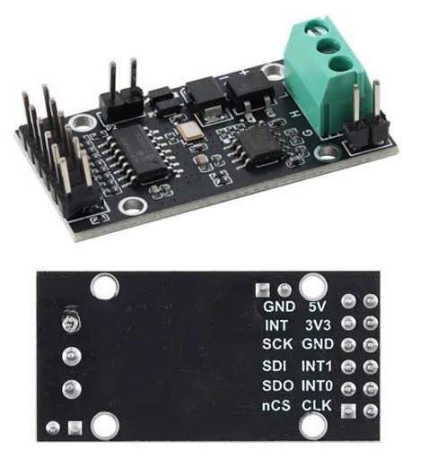
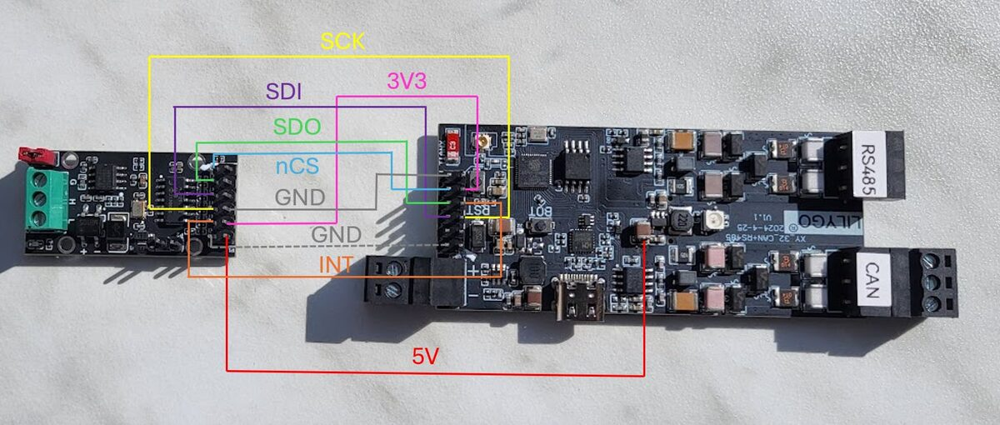
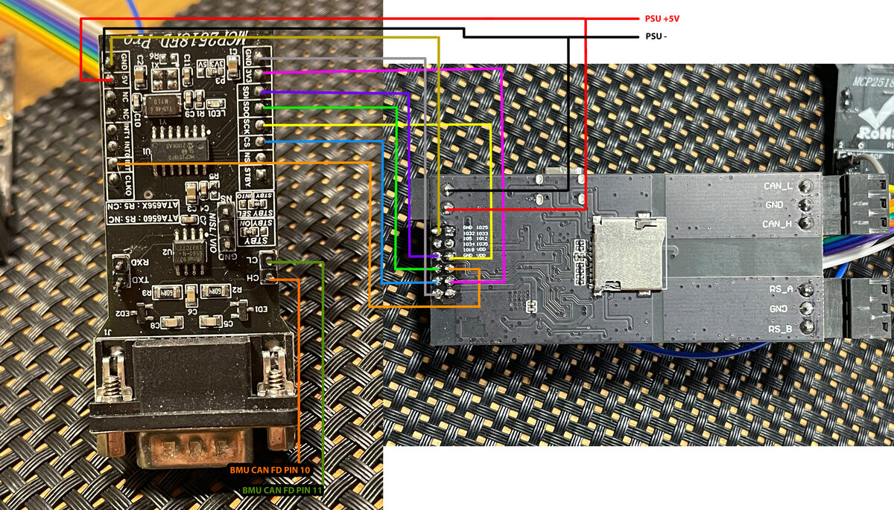
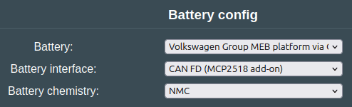
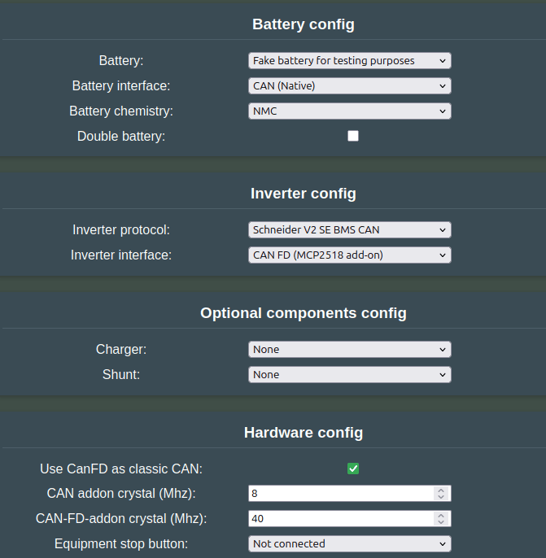
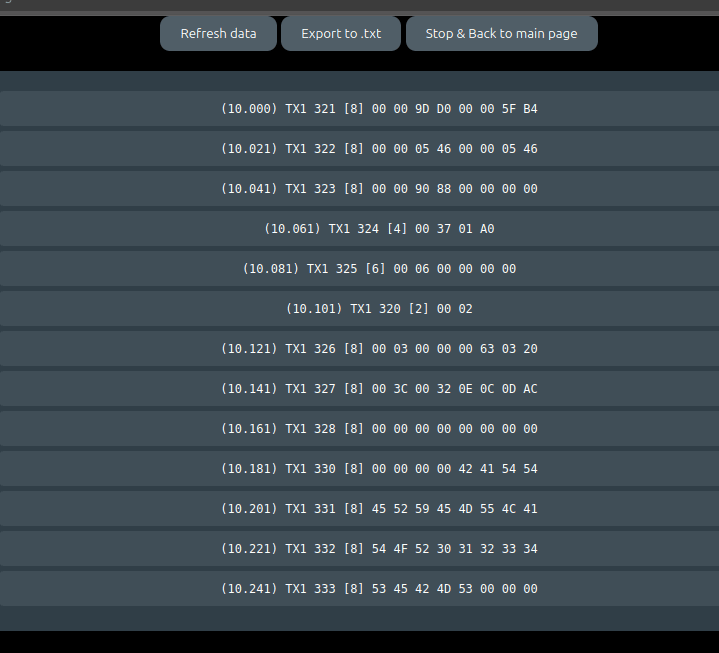
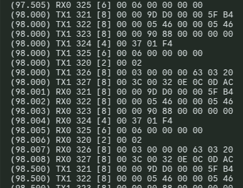

## Why add another CAN channel?

- You may want to set up a [double](../software/battery_2x.md) or a [triple](../software/battery_3x.md) battery system, then each pack must have its own CAN interface.
- Some Inverters do not like to see automotive CAN frames on the CAN channel meant for stationary storage. When they see these messages, they enter a fault state. To get around this, you can add an external CAN interface to the Battery-Emulator hardware, to get a separated CAN bus.

## Why CAN-FD?

Some batteries use CAN-FD instead of classical CAN. Batteries like Kia EV6 are moving towards the faster and more flexible CAN-FD. Most boards, for instance the LilyGo T-CAN485 and T-2CAN, are not compatible with the CAN-FD protocol, but this can be added with an extra MCP2518FD chip via the GPIO pins, similar to the CAN add-on setup.

!!! note "ABOUT"
    **FD** stands for **Flexible Data-Rate** — CAN FD extends classical CAN with up to 64-byte payloads instead of 8, and switches to a faster bit rate (2–8 Mbit/s) after arbitration. Same wiring, same 120 Ω termination, a stronger CRC and no remote frames. The catch: a classical-only controller sees an FD frame as an error and can take the bus down, so every node must be at least FD-tolerant. For ESP32 specifically, the TWAI peripheral is classical-only and not FD-tolerant on the original, S2, S3, and C3. So an ESP32 sitting on a bus that carries FD traffic will fault. The P4 has a proper FD-capable TWAI. Otherwise the usual route is an MCP2518FD on SPI.

### Hardware versions

Models based on **MCP2518FD Pro**:

- [Smaller one](https://www.aliexpress.com/item/1005007349452566.html)
- [Bigger one](https://www.aliexpress.com/item/1005006433378885.html)

!!! important "NOTE"
    While the code technically works with **MCP2517FD** chips, the boards equipped with this apparently have a hardware bug and should be avoided. Please source boards with **MCP2518FD** chips instead to ensure proper CAN-FD operation.

## Example connections

The smaller model needs the jumper near the terminal block needs to be seated in order to have the correct 120Ω bus termination if at cable end.

Examples below show how to connect the **MCP2518FD Pro** to the some of the compatible Battery Emulator boards. Check out the pinout table for each board, to see which pins are defined for MCP2518FD usage.

### The smaller board

| MCP2518FD small | LilyGo T-CAN485 | Waveshare ESP32‐S3‐RS485‐CAN |
|---|---|---|
| SCK | IO 12 | IO 10 |
| SDI | IO 5 | IO 11 |
| SDO | IO 34 | IO 12 |
| nCS | IO 18 | IO 13 |
| INT | IO 35 | IO 14 |
| GND (next to 3V3) | Any GND pin | GND pin |
| 3V3 | VDD pin | 3V3 pin |
| GND (next to 5V) | Any GND pin | GND pin |
| 5V | 5V source | 5V pin |

!!! important "IMPORTANT"
    The board needs **both** the 3.3V and the 5V power inputs. One GND connection is sufficient if the same ground is being used for the powers and data signal.

### The bigger board

| MCP2518FD big | LilyGo T-CAN485 |
|---|---|
| SCK  | IO 12 |
| MOSI | IO 5 |
| MISO | IO 34 |
| CS   | IO 18 |
| INT  | IO 35 |
| GND (next to 3V3) | Any GND pin |
| 3V3  | VDD |
| GND (next to 5V) | Any GND pin |
| 5V   | 5V source |

## Software setup

Then configure the component you want to use CANFD on, by selecting **CAN FD (MCP2518 add-on)** on the component that you intend to connect to the chip.

## Testing operation

If you are unsure if the newly added add-on chip works, you can perform the following loopback test. Connect CAN-H and CAN-L to the native CAN channel with two wires, and set up the code to transmit messages via for instance the Schneider V2 protocol. Remember to enable Use CanFD as classic CAN , and also to configure the interfaces as shown below. Once it is all set up, use the [CAN logging page](can_logging.md) to verify that you get incoming RX messages that match the TX.

Test settings, for looping back CAN with Schneider CAN to battery CAN.

Example where wires not connected: (Only TX, no RX messages)

Example where wires connected (Everything works, TX and RX incoming on native)

## Logging CAN-FD messages

It is possible to log CAN messages via USB serial or Webserver, see the [CAN logging page](can_logging.md) for more info.

## 3D-printable parts

You can print your own DIN mount for this board, check out the [3D‐printable parts page](../hardware/list_of_3d_printable_parts.md).

## See Also

- [CAN add‐on MCP2515](can_add_on_mcp2515.md) (deprecated)
