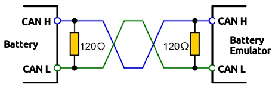
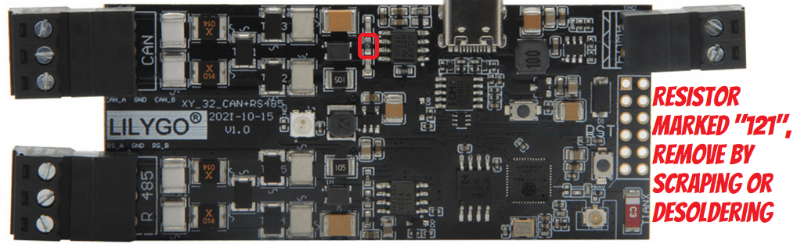
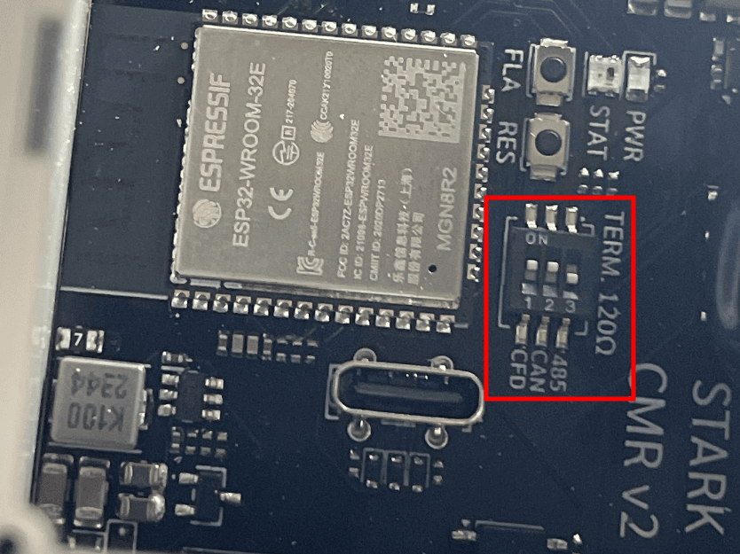
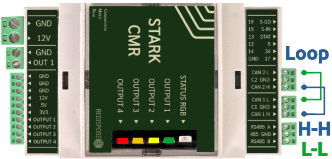
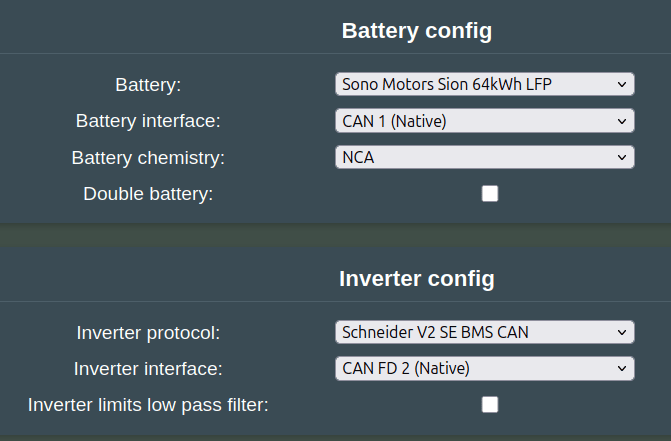
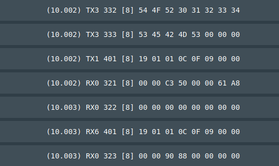

## CAN termination practices

{ width="461" height="149" }

!!! info "IMPORTANT"
    CAN wires need to be **twisted pair** to ensure signal integrity!

Every CAN bus must be terminated with a 120 Ohm resistor at each end of the bus. For quick testing, the exact value of the termination resistors is not always critical. Sometimes a single terminator is sufficient. For final installs, proper termination is essential. If you see strange errors, you should check the termination.

!!! info "IMPORTANT"
    To save yourself a lot of trouble, always terminate the CAN bus properly.

## CAN error messages

Battery Emulator raises several CAN-related events:

### BATTERY_MISSING, INVERTER_MISSING
There has been no CAN communication on the battery or inverter interface for a long time (60s+).

### CAN_..._BUFFER_FULL
Battery Emulator is sending a CAN message to the battery or inverter, but it is not being acknowledged by the other end, so it keeps trying to send it over and over again. So many unsent messages have now queued up that the buffer is full. This can sometimes be a software issue, caused by trying to send too many messages in one go.

### CAN_..._BUS_ERROR
The number of transmit or receive errors has crossed the warning threshold. This threshold is roughly 15 failed or corrupted transmits, or 96 corrupted receives (or a combination of both), with the error counters slowly decrementing after successful communications. This can indicate wiring quality issues.

## CAN troubleshooting

If you get events like `BATTERY_MISSING` or `INVERTER_MISSING`, you need to check the CAN wiring. Here are some basic tips:

* Make sure the Webserver settings is configured correctly, with the right CAN configuration. Example, make sure the Battery is configured to use the correct CAN interface if you see BATTERY_MISSING, for instance if you use LilyGo T-2CAN and connect the battery to CAN-A, configure that port under the Battery Interface.
* Make sure you have flashed the correct software onto your Battery-Emulator board (T-CAN485 instead of T-2CAN is a classic mistake)
* Make sure all CAN devices are turned ON. Verify that the device you are troubleshooting is getting 12V, and that the device is consuming power (typically a few 100mA)
* Verify that the 12V source provides enough voltage. 13.5V is good, 11V will cause issues
* Make sure the polarity of High/Low is correct. High goes to High, Low to Low
* Make sure the terminating resistors are correct. CAN networks should have two 120 Ohm resistors ONE at each end of the network. With everything turned OFF, you can measure resistance between CAN-H and CAN-L. The result should be 60 Ohm. If it shows 120 Ohm, one resistor is missing at an end. If it shows 40 Ohm, you have too many terminating resistors.
* On the LilyGo, the termination resistor can be removed like shown here:

* On the Stark CMR board, the terminating resistor can be turned on/off via the switches on the PCB

* Try a different power supply for the board. Powering it via USB from a computer can cause noise on the signal output. Powerbank or phone charger might have cleaner voltage output. If you see `CAN_TX_FAILURE` occasionally your powersupply might be noisy, or 5V is not strong enough.
* If you are using a board like T-2CAN, it requires 12V to activate the CAN chips, simply powering it via USB is not enough! Generally, if the board has multiple power inputs, use the highest voltage one.

### Loopback testing
To verify that the CAN channels on the Battery-Emulator hardware you have are working properly, you can perform a loopback test. This can be done by connecting two CAN channels together.

Example, loopback test on Stark CMR to verify that both hardware channels are OK

In the Software, enable the following options as a test: **Sono Motors** on CAN1, **Schneider Inverter** on CANFD2

Save and reboot. Open the "CAN logger" page:

You can see  both RX0/TX1 (CAN) function, and RX6/TX3 (CAN-FD). In this successful test both CAN buses can send and receive, since both are visible in the log :heavy_check_mark: 

Bonus: You can also use this handy automated test page for the Stark CMR: [redispose](https://redispose.se/tests/) For all other hardwares, the above mentioned is a good test!

## Wiring and Grounding practices

CAN networks are vulnerable to lightning strikes. [See the dedicated wiki page for this for more info](../hardware/lightning_strike.md) :cloud_with_lightning: 

Be sure to check out the page with [recommendations for low voltage wiring](../hardware/wiring_tips_lv.md).

