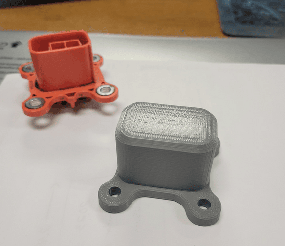
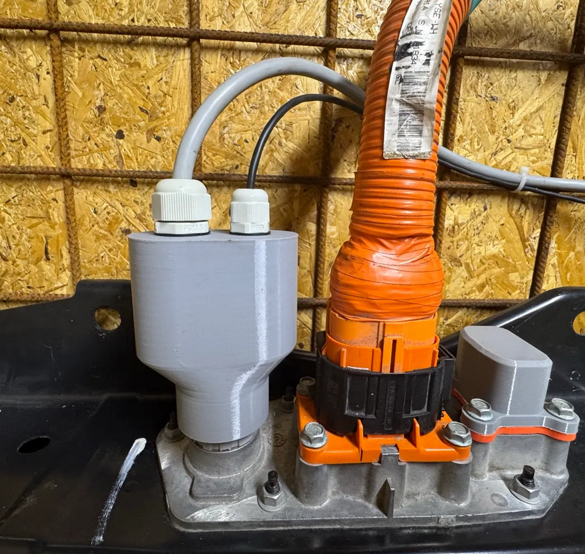
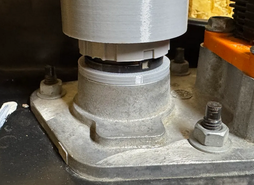
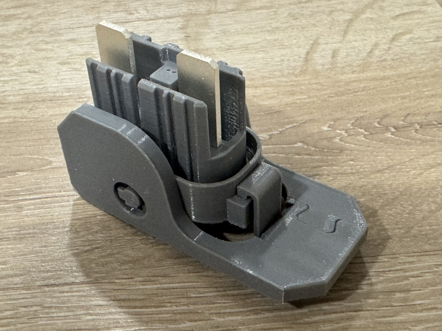
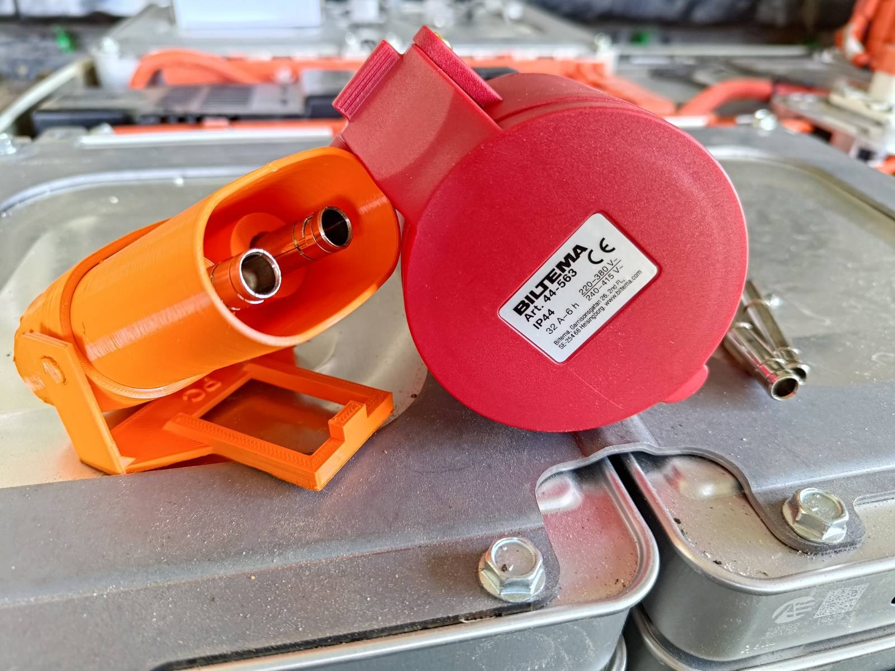
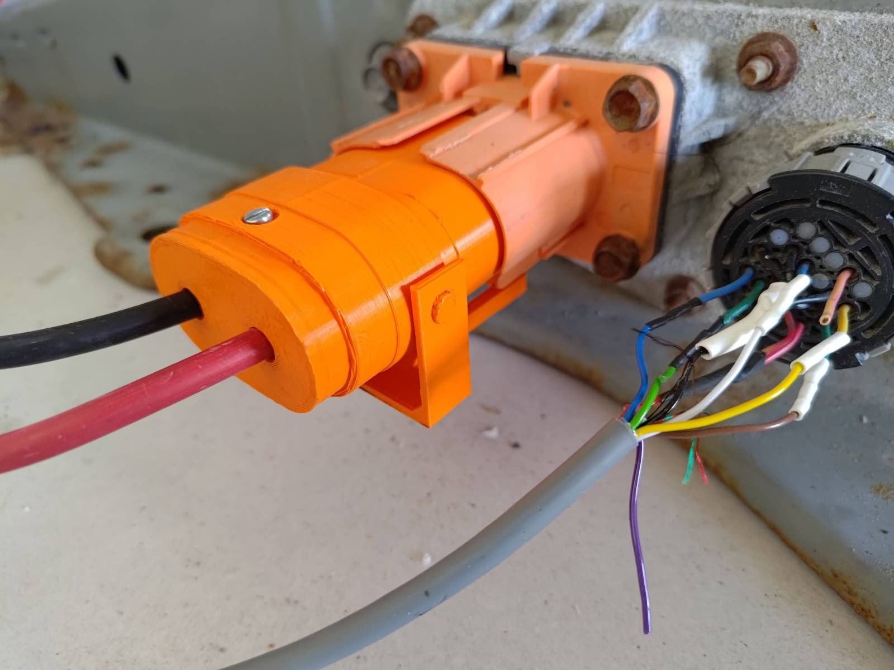

Here's a collection of 3D-printable parts that you can utilize in your build.

## Board fixtures / enclosures

- LilyGo DIN rail: [Thingiverse - DIN Rail enclosure for Lilygo T-CAN-485 Module](https://www.thingiverse.com/thing:6788996)
- LilyGo DIN rail: [Thingiverse - DIN Rail enclosure for Lilygo T-CAN-485 Module with beter ventilation](https://www.thingiverse.com/thing:7029497)
- LilyGo Vertical DIN-rail case: [Lilygo T-CAN485 dinrail case](https://www.printables.com/model/1312677-lilygo-t-can485-dinrail-case)
- LilyGo T_2CAN case: [LilyGo T-2CAN case](https://www.thingiverse.com/thing:7172799)
- LilyGo T_2CAN case with LCD and DIN rail support [LilyGO T2 CAN + Display DIN Rail Mount](https://www.printables.com/model/1567398-lilygo-t2-can-display-din-rail-mount)

## BYD Vehicles

- Front connector cover port: [Abdeckung HV Anschluss Motor vorn.step.zip](https://github.com/user-attachments/files/29167093/Abdeckung.HV.Anschluss.Motor.vorn.step.zip)
- Front connector cover port O-ring version: [Verschlussdeckel Klimaleitung mit O-Ring 2,5mm.step.zip](https://github.com/user-attachments/files/29182999/Verschlussdeckel.Klimaleitung.mit.O-Ring.2.5mm.step.zip)

## Kia/Hyundai 39/64kWh

- AUX HV cover [AUX HV COVER KIA HYUNDAI.zip](https://github.com/user-attachments/files/18517606/AUX.HV.COVER.KIA.HYUNDAI.zip)
- low voltage plug to collect all cables to 20mm pipe [LV COVER KIA HYUNDAI.zip](https://github.com/user-attachments/files/18517605/LV.COVER.KIA.HYUNDAI.zip)

## Tesla Model 3/Y

Charger cover and HVAC covers
[thingiverse](https://www.thingiverse.com/thing:6929352)

X098/logic connector cap
[thingiverse](https://www.thingiverse.com/thing:6945472)

DC Model 3 charge port cap
[printables](https://www.printables.com/model/1695452-tesla-model-3-dc-charge-port-hv-connector-capblank)

Model 3 motor connector cap
[printables](https://www.printables.com/model/1695435-tesla-model-3-motor-hv-connector-capblank)

## Nissan LEAF

### Heater port cover
The 2013-2023 batteries have an external high voltage heater port. The socket can be covered with [3D printed backoff](https://www.printables.com/model/1756569-nissan-leaf-battery-ptc-connector-cover). It can also be plugged with silicone, but beware that certain types of silicone are conductive while uncured. Allow the silicone to cure for 24 hours before engaging contactors in such a case.

### LV connector cover and fixation ring

[This is a dust and water spill protection cover](https://www.printables.com/model/1810318-nissan-leaf-ze0aze0ze1-data-connector-protection-c) for the data connector of Nissan Leaf 2011-2023 batteries. It slides on top of the connector, and uses two cable glands (a PG9 and a PG13.5) to access separately the CAN and a contactor control / BMS power cables:

There's also [a fixation ring for the data connector socket](https://www.printables.com/model/1810328-nissan-leaf-ze0aze0ze1-data-connector-fixation-rin). It slides in the knot at the base of the socket. Use it to prevent the socket to fall into the battery - this can occur when the workers who originally dismounted the battery pack from the car were not careful enough when they disconnected the factory plug, and made the socket loose. This ring is a quick fix you can apply without having to open up the battery penthouse.

### Service Disconnect Switch

Here is a [3D printed SDS for 2013-2023 batteries](https://www.printables.com/model/1337831-nissan-leaf-ze1-service-disconnect-plug) (AZE0, ZE1)
{ width="900" height="675" }

The link contains the drawing of the copper contact part, you can cut yourself and/or ask a workshop to cut and silver-plate it.

### HV Connector

If you are mounting the battery indoors, you can also 3d-print a high voltage plug. This is generally not recommended, due to no IP rating, and no voltage rating. So try to source a real HV connector if possible! That said, this is a link to Pelle_C's excellent 3d-printable connector: [gitlab/pelle8](https://gitlab.com/pelle8/3d)

## Volkswagen MEB

- Cover for the LV connector: [meb_CAN_cover_v1.zip](https://github.com/user-attachments/files/19849815/meb_CAN_cover_v1.zip)
- Cover for the AC Charger port: [MEB-Cover_for_internal_Charger.zip](https://github.com/user-attachments/files/27005556/MEB-Cover_for_internal_Charger.zip)
- Cover for the CCS or Inverter connector: [MEB-Cover_for_inverter_or_CCS.zip](https://github.com/user-attachments/files/26513415/MEB-Cover_for_inverter_or_CCS.zip)

## Ford Mach‐E

The 4 Pin C295 DC/DC Converter connector: [DC Cover 1 +5mm.zip](https://github.com/user-attachments/files/28693976/DC.Cover.1.%2B5mm.zip)
