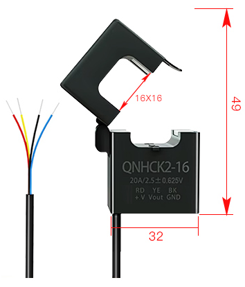
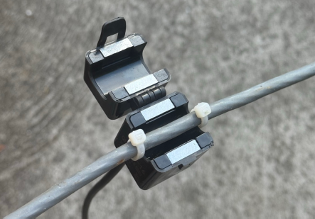
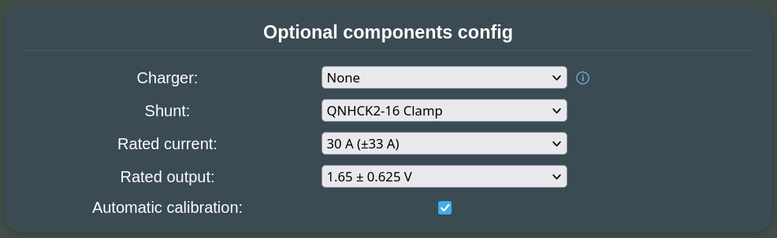
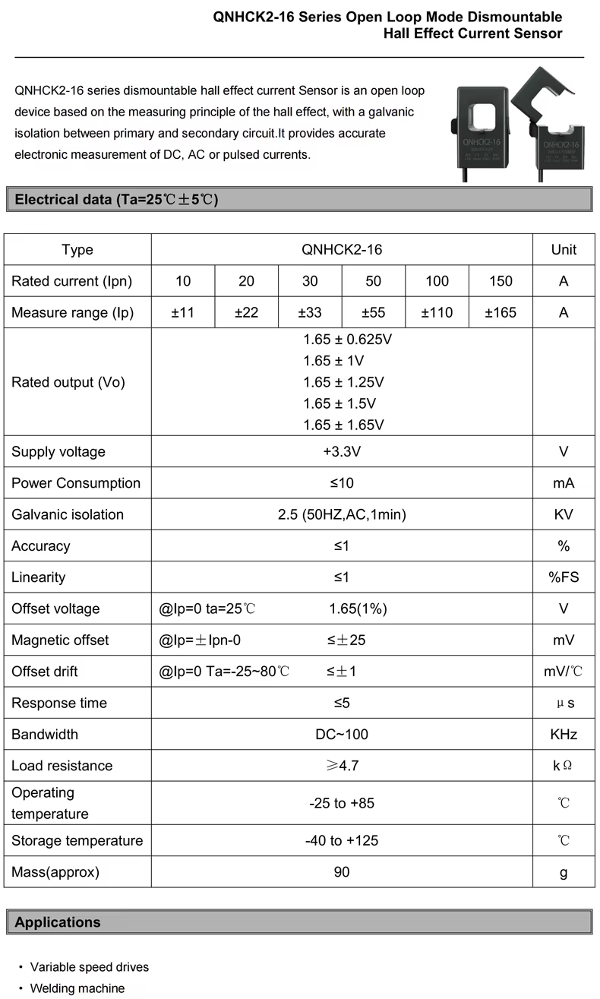
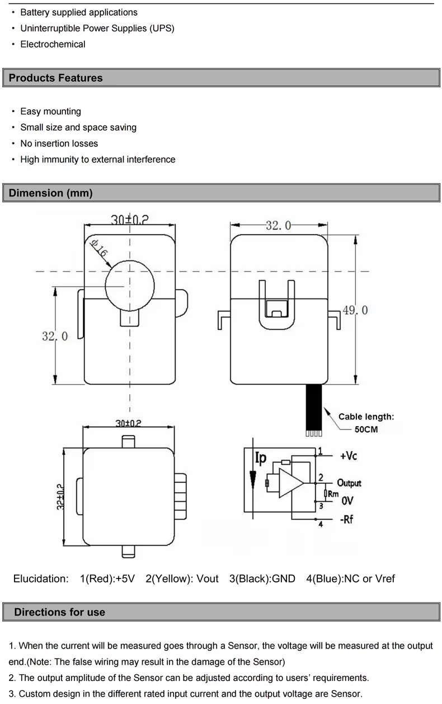

The QNHCK2-16 is an open loop Hall effect current sensor with a split core: it clamps around a battery cable of up to 16 mm diameter without cutting or disconnecting it, and it is galvanically isolated from it. Battery Emulator reads its output voltage through an ADC pin and gives the measured current instead of the current the battery reports via CAN (and with a [double](../software/battery_2x.md) or [triple](../software/battery_3x.md) battery, instead of the sum the packs report). 

This helps when a battery reports its current coarsely or with an offset, and it measures what actually flows through the inverter's cable, in one place, however many packs there are.



| Parameter | QNHCK2-16, 3.3 V version |
| :-- | :-- |
| Rated current (Ipn) | 10, 20, 30, 50, 100 or 150 A |
| Measuring range | ±1.1 × Ipn |
| Rated output at ±Ipn | 1.65 V ± 0.625, 1, 1.25, 1.5 or 1.65 V |
| Supply | 3.3 V, max. 10 mA |
| Accuracy, linearity | ≤ 1 % |
| Zero point (output at 0 A) | 1.65 V ± 1 % |
| Zero point drift | ≤ ±1 mV/°C, and up to ±25 mV after a current of Ipn (magnetic offset) |
| Isolation | 2.5 kV AC, 1 minute |
| Window | Ø 16 mm |
| Leads | 50 cm: red +3.3 V, yellow output, black GND, blue NC or Vref |
| Operating temperature | −25 to +85 °C |

Purchase from: [AliExpress](https://www.aliexpress.com/item/1005006124647110.html).

!!! note "NOTE"
    Despite looking similar, this is not a CT clamp. CTs (current transformers) can only measure AC, they don't work for DC. The [Hall effect current sensor](https://itg-motor.com/what-is-a-hall-effect-current-sensor/) works on a different principle — and it requires separate power to operate.

### Choosing the model

The rated current and the rated output are both printed on the sensor, and each rated current is made with any of the rated outputs. In short, for the most precise readings take **the smallest rated current at or above your inverter's maximum battery current, with a 1.65 ± 1.25 V output**; 1.65 ± 1 V and the common 1.65 ± 0.625 V come next.

**Rated current:** the smallest one at or above the highest current your inverter can charge or discharge the battery with: the maximum battery current in its datasheet, or a lower limit you have set in it. For example, an inverter taking up to 25 A needs the 30 A model. The sensor's errors are fractions of its rated current, so a larger model than needed is less precise in proportion: on that 25 A inverter, a 150 A sensor would be five times worse than the 30 A one. The 10% the sensor measures beyond its rated current is headroom. Above 1.2 × Ipn the emulator stops using the reading, and the inverter gets the batteries' own current until it is back within range.

**Rated output:** the larger it is, the more millivolts each amp gives, so the millivolts the ADC and the zero point are off weigh less. But at the attenuation used here, the ESP32-S3 datasheet only specifies its ADC from 0 to 2.9 V, and the output has to stay within that up to the highest current:

| Rated output | Output at ±Ipn | Stays within 0–2.9 V up to | 1 mV is |
| :-- | :-- | :-- | :-- |
| 1.65 ± 0.625 V | 1.025 – 2.275 V | the whole measuring range ✅ | 0.16 % of Ipn |
| 1.65 ± 1 V | 0.65 – 2.65 V | the whole measuring range ✅ | 0.1 % of Ipn |
| 1.65 ± 1.25 V | 0.4 – 2.9 V | ±Ipn ✅ | 0.08 % of Ipn |
| 1.65 ± 1.5 V | 0.15 – 3.15 V | about ±0.8 × Ipn ⚠️ | 0.067 % of Ipn |
| 1.65 ± 1.65 V | 0 – 3.3 V | about ±0.75 × Ipn ⚠️ | 0.06 % of Ipn |

??? quote "Details"
    Above 2.9 V the ADC's readings are not reliable and soon stop rising, so the inverter would be told less current than flows, without the emulator noticing. Avoid the ±1.5 V and ±1.65 V outputs for that reason. The 3.3 V version is mostly sold with 1.65 ± 0.625 V, which works well with half the resolution of ±1.25 V; according to its datasheet, the manufacturer makes the other outputs on request.

    What a millivolt is worth in amps: 0.048 A on a 30 A sensor with 1.65 ± 0.625 V, and 0.024 A on one with 1.65 ± 1.25 V. The millivolts that count:

    * The zero point is 1.65 V ± 16.5 mV out of the box. The [calibration](#configuration) takes this out, together with the ADC's own error at that point.
    * The ADC itself can be off by tens of millivolts across its range (up to ±50 mV according to the ESP32-S3 datasheet).
    * The zero point drifts by up to 1 mV per °C, and moves by up to 25 mV after heavy current. This builds up between two calibrations: on the 30 A sensor with 1.65 ± 0.625 V, a 10 °C change is up to 0.5 A. The [temperature compensation](#temperature-compensation) can take most of the temperature part out.
    * The datasheet's accuracy and linearity only hold at 25 ± 5 °C, and it gives no figure for how the sensitivity changes with temperature, so readings at high current may be a little further off in a hot or cold place.

!!! note "3.3 V or 5 V version"
    The QNHCK2-16 also has a version for a 5 V supply, with its zero point at 2.5 V and outputs of 2.5 ± 0.625 V or 2.5 ± 2 V. **Only the 3.3 V version** can be used with ESP32: 2.5 ± 2 V goes up to 4.5 V, which can damage the ESP32's pin (3.6 V at most), and the emulator refuses a zero point further than 0.2 V from 1.65 V. Both versions share the name and the housing, so check the label: the rated output printed on it has to start with 1.65 V. Never supply the 3.3 V version with 5 V either.

## LV Wiring

The sensor takes its 3.3 V supply from the board, and its output goes to an ADC pin, which depends on the board:

| Sensor wire | Function | [Waveshare ESP32-S3-RS485-CAN](../../hardware/waveshare_esp32_s3_rs485_can.md): 4-pin SH1.0 connector behind the USB-C socket | [LilyGo T-2CAN](../../hardware/lilygo_t_2can.md): configurable QWIIC port | [BECom](../../hardware/becom.md): expansion socket J5 |
| :-- | :-- | :-- | :-- | :-- |
| Red | +3.3 V supply | 2 (3V3) | 3V3 | 29 (+3.3V) |
| Black | GND | 1 (GND) | GND | 13 (GND) |
| Yellow | Output | 4 (GPIO1) | IO01 | 23 (IO4) |
| Blue/shield | NC or Vref | not connected, insulate its end | not connected | not connected |

On the Waveshare and the T-2CAN, a pigtail with a 4-pin JST SH (1.0 mm pitch) plug makes the connection: Waveshare bundles it with the unit, LilyGo sells a [pre-made one](https://lilygo.cc/products/dupont-cable). The Waveshare's connector is the one the [status LED](../../hardware/waveshare_esp32_s3_rs485_can.md#status-led-neopixel-via-gpio2) uses, the T-2CAN's is the second one, labelled GND/3V3/IO01/IO02. J5 on the BECom is a 2×15 socket with 1.27 mm pitch.

!!! warning "CAUTION"
    Supply the sensor with 3.3 V only, and check each wire before powering up: the datasheet warns that wrong wiring can damage the sensor. Its pin legend says "+5V" for the red wire, which is the 5 V version's; the 3.3 V version takes 3.3 V there.

* Before connecting the yellow wire, measure it against black with no current through the sensor: it should read close to 1.65 V.
* Waveshare: GPIO1 is also the I2C display's SDA pin, so the two cannot be used together: keep **GPIO 1/2 function** (Settings → Hardware config) at **Status LED (GPIO2)**. A status LED on GPIO2 can share the 3V3 and GND pins with the sensor.
* T-2CAN: IO01 belongs to the configurable port. Keep **Configurable port** (Settings → Hardware config) at **WUP1 / WUP2**, and use neither a battery that needs wake-up pin 1 (CMP Smart Car) nor the I2C display or E-Stop / BMS Power options.
* BECom: IO4 is not used for anything else.
* If the pin is taken by something else after all, the Events page reports a GPIO conflict and the sensor is not used.
* The leads can be extended: twist the output together with GND, or use shielded cable, and keep it away from HV cables and contactor coil wiring. The emulator averages up to a thousand readings every second, which smooths out noise.
* Do not load the output: the datasheet asks for at least 4.7 kΩ. The ADC pin needs nothing added, no divider or pull resistor.

??? quote "ADC pin on other boards"
    The pin is fixed for each board in the firmware (`SHUNT_ADC_PIN()` in its HAL), and boards without one do not offer the sensor. A good pin for a new one:

    * is on ADC1 (ESP32-S3: GPIO1–10, ESP32: GPIO32–39), since ADC2 is shared with Wi-Fi and cannot be read reliably while Wi-Fi runs,
    * is not a strapping pin, and not used for anything else on that board.
    
    The classic ESP32's ADC only reads accurately up to about 2.45 V, which leaves only the ±0.625 V output fully usable there.

## HV Wiring

!!! warning "CAUTION"
    Fit the sensor with the system switched off and the battery disconnected, and only around an insulated cable, never around a bare conductor or busbar. See also [HV wiring tips](wiring_tips_hv.md).

* **Around one conductor:** either the positive or the negative battery cable, never both, as their currents cancel out.
* **Between the contactors and the inverter:** the sensor has to carry exactly the current the inverter charges and discharges with, and none while the contactors are open, which the automatic calibration relies on. Nothing else may draw from or feed into the cable where it sits.
* **Double or triple battery:** on the cable to the inverter, after the point where the packs join, so it measures their total. On one pack's cable it would only see that pack's share, and the inverter would take it for the total.
* **Direction:** the emulator counts charging current as positive, so the output has to rise above 1.65 V while the battery charges. If the housing has an arrow, point it the way the charging current flows: towards the battery on the positive cable, towards the inverter on the negative one. Check it once running (see [Checking it works](#checking-it-works)). If charging shows as discharging, open the clamp, turn it around and close it again; there is no setting to invert it.
* **Fully closed:** the two halves have to latch together with nothing between their faces, as a gap lowers the reading. Center the cable in the window, fix the sensor with a cable tie so it cannot move, and keep it away from other current carrying cables, contactors and relays, whose magnetic fields shift its reading.
* **Perpendicular (optional):** to ensure maximum accuracy, you can use the two little ears and small wire straps on the sensor to fixate the wire against the sensor, so it falls in exact perpendicular angle against the loop:



## Configuration

The sensor is supported on the [Waveshare ESP32-S3-RS485-CAN](../../hardware/waveshare_esp32_s3_rs485_can.md), the [LilyGo T-2CAN](../../hardware/lilygo_t_2can.md) and the [BECom](../../hardware/becom.md); other boards do not list it.

--8<-- "snippets/small_flash.md"

In **Settings → Optional components config**:



* **Measurement:** QNHCK2-16 Clamp
* **Rated current:** as printed on the sensor, e.g. 30 A (±33 A)
* **Rated output:** as printed on the sensor, e.g. 1.65 ± 0.625 V
* **Automatic calibration:** ticked by default, see below
* **Zero point drift (mV/°C):** 0 (off) by default, see [Temperature compensation](#temperature-compensation)

Save and reboot. The main page then shows it as e.g. **Measurement: QNHCK2-16 (30A ±0.625V) ✓**. The ✓ means the sensor's current is the one in use. A red ✗ means the batteries' own is used instead, because the sensor has no reading yet, its zero point has not been measured yet, it reads more than 1.2 × its rated current, or its pin is not available (the Events page then reports a GPIO conflict).

### Automatic calibration

No sensor has its zero point at exactly 1.65 V, and it drifts with temperature, so it has to be measured. With **Automatic calibration** ticked, the emulator does this every time the contactors open, when no current can flow through the sensor: from 0.3 s after they open until they close again, over the latest 10 seconds. As they close, the log shows, for example:

```
QNHCK2-16 zero point calibrated to 1644 mV at 12.0 °C
```

With [Contactor control via GPIO](../software/contactor_control_via_gpio_pins.md) enabled the contactors stay open for at least 10 seconds after every boot, so the zero point is measured within seconds of booting, and nothing needs to be stored. Until then, the inverter gets the batteries' own current (✗ on the main page). The zero point then holds until the contactors open again: at the next boot, when **Open Contactors** is pressed on the main page, when the inverter asks for it, or after a fault.

Requirements:

* **Contactor control via GPIO** (Settings → Hardware config), because only the contactors the emulator drives itself tell it for sure that no current flows. With double or triple batteries, you'd need **2ⁿᵈ battery contactor control via GPIO** and **3ʳᵈ battery contactor control via GPIO** too. Without them, the log warns at boot and the sensor's reading is never used: set up [Contactor control via GPIO](../software/contactor_control_via_gpio_pins.md), or use the manual calibration.
* The sensor sits where the current stops as the contactors open (see [HV Wiring](#hv-wiring)).

A measurement further than 0.2 V from 1.65 V is not used, and the log names the pin and what it read (see [LV Wiring](#lv-wiring)).

### Temperature compensation

The zero point drifts with temperature, and in a stationary system the contactors may stay closed for weeks, long enough for a season's worth of temperature change to build up. **Zero point drift (mV/°C)**, shown while **Automatic calibration** is ticked, makes up for it. As each zero point measurement ends, the emulator notes the reported temperature. From then on it moves the zero point by the set amount for every °C that temperature changes, until the contactors open again and the next measurement starts over from a new temperature.

Although the datasheet only limits the sensor's drift to ±1 mV/°C either way, each sensor's own figure has to be found. The setting accepts −5.0 to +5.0 mV/°C in 0.1 steps, since the figure found this way also takes in the ADC's drift. 0, the default, is off.

To find it, compare the zero points the log shows at different temperatures. Typically this can be done early in the morning for a low temperature point, and late in the afternoon for a high one. 

In **Settings** make sure you have enabled **General logging via Webserver**, and reboot the emulator once early in the morning and once late in the afternoon. After each reboot, look in the log and note the displayed values:

```
QNHCK2-16 zero point calibrated to 1644 mV at 12.0 °C     → morning values
QNHCK2-16 zero point calibrated to 1653 mV at 19.0 °C     → afternoon values
```

Divide the difference in mV by the difference in °C, keeping the sign: **(1653 − 1644) / (19.0 − 12.0) = 1.3 mV/°C**. A zero point that falls as it gets warmer gives a negative figure. Each reading is used as measured, without compensation, even with [manual calibration](#manual-calibration).

### Manual calibration

For setups whose contactors the emulator does not drive through GPIO, e.g. batteries that close their own over CAN:

1. Untick **Automatic calibration**, save and reboot. The **Manual calibration** row shows the zero point in use, `1.650 V (default)` at first.
2. Stop all current through the sensor: open the contactors, e.g. with **Open Contactors** on the main page, or take the clamp off the cable, close it and keep it away from other cables.
3. Wait a few seconds, as the reading is the mean of the last second, then press **Start**.

The result, e.g. `1.648 V (calibrated)`, is used right away and stored, and the log shows `QNHCK2-16 zero point calibrated to 1648 mV`. A reading further than 0.2 V from 1.65 V is refused, with a message saying what GPIO1 read. 

### Checking it works

While the inverter charges the battery, the main page has to show a positive current, and the battery card has to say it is charging. With a single battery, the battery card shows the sensor's current. With double or triple batteries, the combined card on top shows it, while the pack cards below keep showing what each pack reports: the top one should be close to their sum. If charging shows as discharging, turn the sensor around (see [HV Wiring](#hv-wiring)).

The log (**Log** on the main page, with **General logging via Webserver** enabled) tells what the sensor does:

| Log message | Meaning |
| :-- | :-- |
| `QNHCK2-16 on GPIO1: 30 A ±0.625 V, zero point measured while the contactors are open` | Started, with automatic calibration |
| `QNHCK2-16: zero point follows the batteries' temperature by 0.9 mV/°C` | Started, with [temperature compensation](#temperature-compensation) |
| `QNHCK2-16 on GPIO1: 30 A ±0.625 V, zero point 1648 mV` | Started, with the zero point stored by the manual calibration |
| `QNHCK2-16 zero point calibrated to 1648 mV at 21.5 °C` | New zero point measured, at that battery temperature. Without the temperature while no battery reports one, and with the manual calibration |
| `QNHCK2-16: automatic calibration needs contactor control via GPIO for every battery. Its reading is not used until then.` | See [Automatic calibration](#automatic-calibration) |
| `QNHCK2-16: GPIO1 reads 93 mV with the contactors open, too far from 1.65 V to be its zero point.` | Check its supply and the pin, see [LV Wiring](#lv-wiring) |
| `QNHCK2-16 reads 36500 mA, beyond its range. Using the current the batteries report.` | More than 1.2 × its rated current. `QNHCK2-16 reading back within range.` follows when it drops again |





## More info
* [Waveshare ESP32-S3-RS485-CAN](../../hardware/waveshare_esp32_s3_rs485_can.md), [LilyGo T-2CAN](../../hardware/lilygo_t_2can.md) and [BECom](../../hardware/becom.md), the boards and their connectors
* [Contactor control via GPIO](../software/contactor_control_via_gpio_pins.md), needed for the automatic calibration
* [Double Battery](../software/battery_2x.md) and [Triple Battery](../software/battery_3x.md)
* [Manufacturer's product page](https://njqineng.en.made-in-china.com/product/trFUNzKOAHkG/China-Qnhck2-16-Input-10A-20A-30A-50A-100A-Output-2-5-0-625V-2-5-2V-DC-Hall-Effect-Current-Transducer-Clamp-CT-Split-Core-Current-Sensor-Transformer.html) (Nanjing Qineng Electronic Technology)
* [ESP32-S3 datasheet](https://documentation.espressif.com/esp32-s3_datasheet_en.pdf), ADC characteristics in section 5
* [Hall effect current sensor](https://itg-motor.com/what-is-a-hall-effect-current-sensor/) working principle
