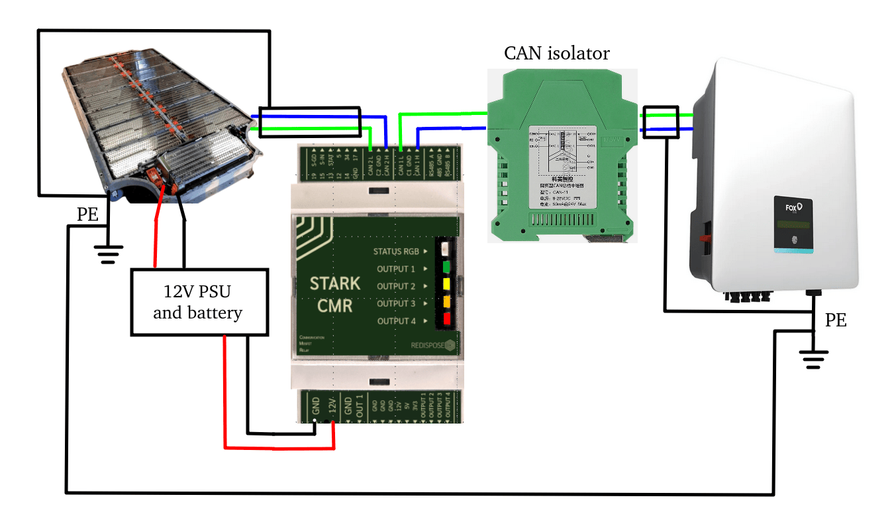
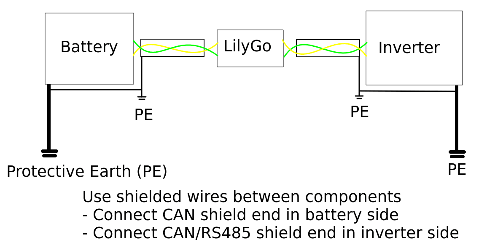
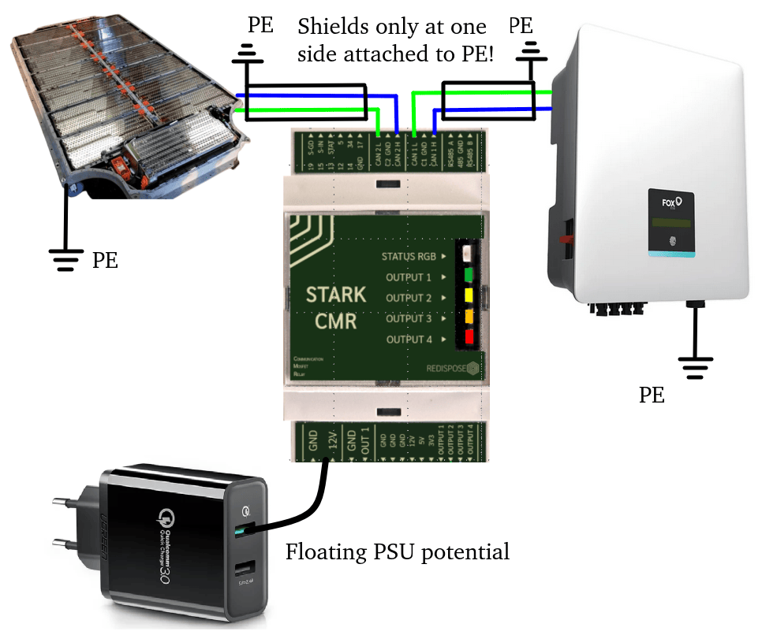

## Data signal

CAN communication at 500kbps is good for maximum 100m. RS485 or Modbus, with proper cabling, can go 300m and even up to 1km.

!!! note "IMPORTANT"
    Data wires carrying CAN and Modbus data need to be in **twisted pair** to ensure signal integrity. Make sure the cable you are using is **shielded**. 

Data cable max lengths may be specified by inverter manufacturers in their installer manuals. Respect these distances if possible, to avoid problems. However, since EV batteries may not be installed [in the same circumstances](../installation_guidelines.md) as home battery packs, you may need to use longer cable runs. Compensation can be made by choosing carefully. 

The easiest choice is shielded CAT6 cabling used for Ethernet networks, where you only use one pair of the four. Other options include cables designed for Modbus, BACnet MS/TP, CANopen, or DMX512. Choose a good quality shielded twister pair model of at least 0.2 - 0.3mm² (22 - 24 AWG) cross section per wire. As usual, the longer, the tchicker.

If you're into deciding where to place Battery Emulator, closer to the battery, or closer to the inverter, if there are no other influencing factors, place it closer to the battery. This advice is based on the thought that the CAN interface in the battery is originally designed to take part in a network of CAN devices within a car, at maximum distance of a few meters, whilst inverter data interfaces (be it CAN or Modbus) are rated to work on longer cable runs on purpose. Do that especially if you using an RS485/Modbus inverter - that protocol is especially optimal for long distances.
    
!!! danger "CAUTION"
    Grounding everything is especially important for certain inverters. If you fail to ground inverter or battery casing to a commoon protective earth potential (PE), a voltage difference between the two components may develop, which can fry the CAN communication chips on the Battery Emulator board. Always connect every component, and the communication shield wire to **the same** protective earth before turning the system on!

See this example for grounding: 

!!! tip "IMPORTANT"
    Only **one end of the shield** drain wire should be connected to a pin labelled SHIELD (or PE if no dedicated shield exists). This avoids ground loops. 

Here is the best way to ensure that there are no paths for spikes in CAN voltage to fry chips on the boards (Important for [Solax](../../inverter/solax.md) and [Foxess](../../inverter/foxess_h1_h3_ac1_kh.md), other inverters are more lenient on what power supply you use)

!!! warning "CAUTION"
    Again: **Never** connect the shield drain wire on both sides, to avoid creating a ground loop. One side of the shield should be free floating, like shown in the above pictures.

## Control signal (12V)

HV battery packs from EVs usually require an external 12V input at least to power the BMS. Many packs despite having built-in HV contactors, they are controlled externally with 12V signals. Since contactors themselves contain coils which draw rather high currents compared to what a microcontroller can provide, external relays/SSRs/Mosfets are used to drive these.

!!! tip "Precharge/Contactor closing"
    Almost all EV batteries contain contactors and precharge relays. Contactors act like big relays, and are used to control electrical circuits where currents are high. They are designed to be able to break the flow of current in a safe manner without electrical arcing. Usually there are at least two of them, one for positive and one for negative, and a third one for circuit precharging. To avoid electrical arcing when turning on the battery, the initial inrush of current is led thru a precharge resistor, to allow for slow charging of the capacitors inside the inverter. If the inverter has been turned off for a long time, the capacitors inside will act almost as a dead-short, 0 ohm resistance. If you would skip using the precharge, then your contactors will spark every time you close them, wearing them out prematurely. Negative, precharge and positive need to be switched separately in order, to ensure safe operation even if some malfunction would occur. Now that we know what the contactors/precharge does, we can look at how to control it.

Contactors within HV packs drain continuously around 0.5A each, at 12V. Usually there are at least two of them, one for positive and one for negative, and a third one for circuit precharging. Varrying by type, an inrush current can develop for a very small amount of time when applying power to these contactors.

Thus, the 12V power source (and backup battery) you use must be able to handle these. Generally a 12V 2.5A power supply should be enough for Battery Emulator hardware and the battery pack with it's own contactors, and this applies even if the contactors are controlled over CAN. A good example is **Mean Well DRC-40A**. If you use multiple packs in a [double](../software/battery_2x.md) or [triple](../software/battery_3x.md) setup, you'll need a bigger 12V supply accordingly. 

!!! warning "CAUTION"
    To avoid welded contacts ensure you have a 12V backup system to avoid unwanted contact closings under load in case of a blackout. When shutting down a working battery system, no load can be present on the HV circuit. First shut down inverter before shutting off the battery, OR use the PAUSE button in the Webserver to ensure that 0A of current before shutting down the battery. Certain batteries have extremely sensitive welding detection. If there is over a few A of current during opening of contactors, they will set the "Contactors Welded" state in their BMS and lock the battery permanently.

**Don't** use the free CAT5/6 cable wires you have next to the CAN bus to externally drive contactors at 12V. Not only they are too thin, the contactors's inrush currents may cause interference with CAN / Modbus if you do that. Regular Ethernet cable wires go between 0.12 - 0.25mm² (23 - 26 AWG). You need at least 0.5mm² (20 AWG) which rated for max 0.5A on a few meters distance. 

Increasing distance significantly will need to increase wire tchickness too, in order to avoid energy loss on the cable itself, just like it happens for [for high voltage](wiring_tips_hv.md). For tens of meters of cable path, use at least 1.5mm² (AWG 14) cable to drive the BMS and the contactors with 12V.

If you wanna go really pro, you can use automotive grade cable (FLRY-A or B ISO 6722):

* FLRY-A Automotive low voltage cable (FL) with reduced thickness of insulation (R) made of PVC (Y), with regularly stranded conductor (A)
* FLRY-B Automotive low voltage cable (FL) with reduced thickness of insulation (R) made of PVC (Y), with irregularly stranded conductor (B)
