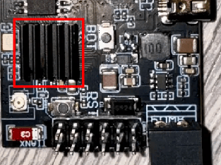
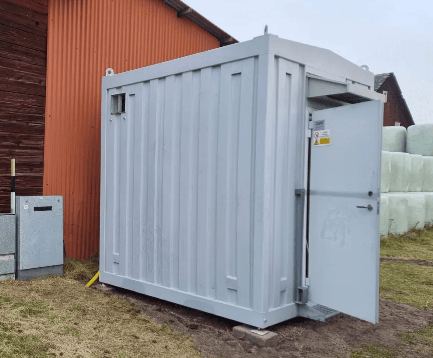

This section will guide you towards making a safer installation of the battery. Please start by familiarizing yourself with your local regulations regarding solar inverters and stationary storage requirements. Make sure the inverter selection is approved by your grid operator before ordering parts. Finally, make sure the person installing the hardware has a valid electrical safety & installation training.

!!! warning "CAUTION"
    ***At the end of the day, you alone are responsible for the system.***

## Battery placement
The most important decision to make is battery placement. Any used EV pack should always be operated in an area where a potential fire would not be of risk for human life. Almost all salvage batteries come from crashed vehicles, with an unknown history. While the Battery-Emulator and your solar inverter performs several safety checks, note that almost all checks rely on communication data, so a physical error (damaged cell casings, ruptured/leaking cells, corrosion etc.) wont be easily detectable via software.

Due to all this, it is recommended to only install batteries in the following places:

* Outside
* Detached garage
* Tool-shed
* Underground
* Shipping container

Regardless of placement, great care must be taken to avoid water getting into the battery. While most EV batteries are splash proof, they cannot cope with large amounts of water/rain. If you are installing a battery outside, construct a roof to keep the battery dry.

!!! tip "TIP"
    Batteries can often be tilted, and installed on the side of a wall to save space. To this date we have not encountered any packs that would not function in a wallmounted position!

## Wiring

Check out the dedicated [High Voltage](hardware/wiring_tips_hv.md) and [Low Voltage](hardware/wiring_tips_lv.md) wiring pages with tips and examples on how to make the connections safely. Consider protection against [lighning strikes](hardware/lightning_strike.md) when choosing a location deploying cabling.
    
## Keeping the temperature in check
Lithium batteries are like humans, they perform best at 20°C. Many installs will have the batteries outside or in basic sheds/shelters. This means the battery might be subject to extreme temperatures, which will affect the battery performance. Depending on your climate, this might mean -40°C, or +40°C, both being bad for battery performance/longevity.

**Hot tips** :hot_face: Many lithium battery chemistries stop taking charge/discharge at >50°C. Having the battery in direct sunlight in a hot climate like Australia can cause high temperature shutdown. This can be avoided by placing the battery in a shaded area, and/or utilizing the coolant loops found on some battery packs like Tesla batteries. For [temperate climates](https://en.wikipedia.org/wiki/Temperate_climate) this is usually not required at all. In the event that temperature cannot be maintained below 50°C, the Battery Emulator will automatically stop power transfer and raise an overheated fault event.

**Cold tips** :snowflake: The same is true for the other side of the thermometer, at low temperatures it is not possible to charge/discharge lithium batteries. This lower temperature limit depends on what chemistry is used. LFP batteries start to struggle already at <0°C, while other cells such LMO and NMC can still perform at -20°C. Simply using the battery by charging and discharging it will generate heat, and by putting the battery in an isolated space, this self-generated heat can be enough to keep the battery performing thru winter. Simply keeping the contactors engaged in a battery will consume between 10-20Watts, which is excellent for keeping some heat in it. Some batteries also contain heating elements, which will automatically turn on when it gets too cold. An example of this is the Nissan LEAF battery, which can have internal heating elements that turn on at < -17°C (provided the battery is equipped with the cold climate add-on). Other batteries like Tesla S/3/X/Y has coolant loops, which you can run a heated loop thru in order to keep the battery warm during the winter. A simple space heater can also be used to keep a battery shed heated during the winter. If the battery gets too cold, <-25°C ,the Battery Emulator will automatically stop power transfer and raise a battery frozen fault event.

### Keeping the Battery-Emulator cooler
While on the topic of temperatures, it is also important to keep the hardware running the Battery-Emulator cool. The ESP32 CPU used in all hardware solutions will start to have Wifi issues if the chip gets too hot (at around 85-95°C), and if the CPU continues to heat up towards its maximum rating it will lock up and crash (at around 125°C). This temperature measurement works great on ESP32-S3 chips, but the older ESP32 is notorious for having poorly calibrated CPU temperature. So verify with external thermometer!

**ESP32 tips** :thermometer: Mounting the Battery-Emulator hardware inside a small plastic case can lead to overheating if the ambient temperature is high enough. If you experience wifi issues, and notice high CPU temperatures, the following steps can be taken to reduce temperatures and improve stability;

1. Disable Access Point. Connecting the Battery-Emulator directly to your home wifi instead of using an AP will keep the CPU cooler!
2. Disable ESPNow if you don't use it. ESPNow, just like Access Point, increases CPU temperature significantly!
3. Open the lid / drill some ventilation holes if possible. Only do this if the enclosure is not exposed to water!
4. You can also mount a small heatsink to the CPU. RAM heatsinks make for great makeshift ESP32 heatsinks!
[aliexpress](https://vi.aliexpress.com/w/wholesale-Raspberry-Pi--aluminium-heatsink.html)
5. For extreme ambient temperatures (>40°C), you can further combat the overheating by mounting a fan to provide some air circulation

_Example, heatsink mounted on top of ESP32 CPU, for use in extreme ambient conditions_

## Examples of battery placement
Below are a few examples of safe battery placements. These can be used for inspiration and ideas for your build.

Example: Detached garage, vertical placement

Example: Wallmounted, with extra roofing

Example: Outside, vertical placement with waterproofing

Example: Underground concrete sarcophagus 

Example: Shipping container

## Optional stuff!

!!! tip "TIP"
    You can also add an [equipment stop button](software/equipment_stop.md) to the Battery-Emulator, to make it easier to stop the system.

[IP67 1NO1NC Stop Switch](https://vi.aliexpress.com/item/1005008119829541.html)

[Resistor kit](https://vi.aliexpress.com/item/1005006699173023.html)

## Periodic maintenance :wrench: 
While EV batteries are designed to be low-maintenance, periodic checks are crucial for ensuring long-term reliability, maximizing performance, and guaranteeing safety. A proactive maintenance schedule can prevent costly failures and identify potential issues before they become serious hazards.

The information below is general guidance.

!!! warning "CAUTION"
    De-energize and isolate the system from all power sources (AC and DC) before performing any physical maintenance, and only qualified personnel should perform these tasks.

## Software update :cd: 
Perform periodic [over the air software updates](software/ota_update.md) to the Battery-Emulator board. Pay extra attention to the [release notes](https://github.com/dalathegreat/Battery-Emulator/releases), and if you see an improvement concerning the components you are using, update the system. If you see changes concerning Safety, also update the system right away.

- Frequency: Check every 2-3 months if updates are available

## Terminal tightness :nut_and_bolt: 

Perform a periodic terminal tightness check to avoid loose connections as described in [recommendations for high voltage wiring](hardware/wiring_tips_hv.md).

- Frequency: Check once per year that your terminals are tight, especially when using Aluminium HV wires

## State of Health (SOH) and efficiency :battery:
EV batteries provide valuable data that is part of a digital maintenance routine.

- Why it's Important: Tracking SOH and cell balance helps predict system lifespan and identify abnormal performance drops that may indicate a failing cell or module.
- Procedure:
  - Monthly: Open the Battery-Emulator Webserver. Check for any active fault codes or warnings. Tip, if the LED on the Battery-Emulator is Green, no Warnings/Errors are active.
   - Bi-monthly: Record key metrics like:
      - State of Health (SOH): The battery's capacity relative to its original state.
      - Cell balance: The better a battery is balanced, the more energy you can safely extract from it. Keep a track of the deviation in mV, by visiting the Cellmonitor page.

## Visual Inspection :eyes: 
A simple visual check can reveal many early warning signs.

- Frequency: Monthly.
- What to Look For:
   - EV battery case: Signs of corrosion, damage, or water ingress.
   - Cabling: Fraying, cracking, chew marks from pests, or signs of overheating (discoloration).
   - General Area: Ensure the area around the battery is clean, dry, and free from flammable materials.
