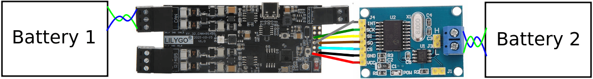
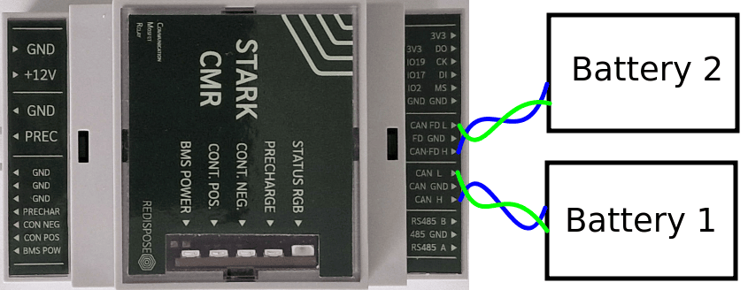
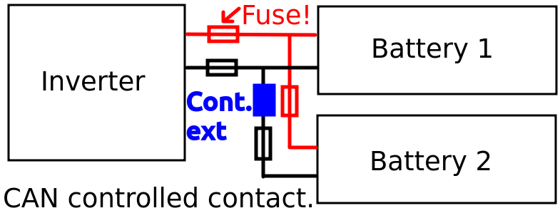
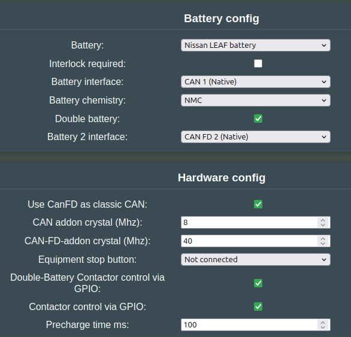
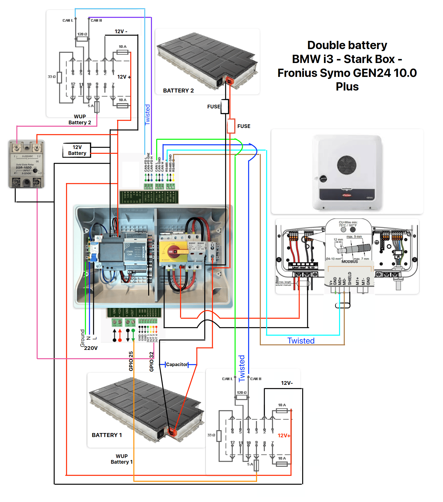

### What is this feature?
Double Battery means running two battery packs at the same time. This doubles the capacity of the system. Incase you need more energy than one EV pack can provide, this functionality is for you.

Good info on running multiple packs and associated risks: [orionbms](https://www.orionbms.com/manuals/pdf/parallel_strings.pdf)

If you need more capacity than Double Battery provides, you can also go [Triple Battery](battery_3x.md).

### How does parallel operation work?
The batteries get connected in parallel. This means the voltage stays the same, but the capacity doubles.

!!! info "IMPORTANT"
    The batteries need to be of the same model and size, and preferably as close as possible in state of health. Do not connect battery packs with too much variation in condition, this lowers overall efficiency significantly!

!!! danger "CAUTION"
    Do not connect packs in series!
    
    - How to ensure balancing, that each battery reaches 100%? In parallel operation this is easy, in series it's next to impossible.
    - There are no safeties implemented for operation in series connection! No control over CAN controlled contactors would make this feature hard to use safely.
    - None of the isolation is designed for double the working voltage. Yes, each battery only sees it's own voltage, but the isolation to earth and in the BMS comms suddenly sees twice. As do any internal contactors, which is probably the more immediate issue.

### Which inverters are compatible?
Double-Battery can be run on all inverters. The inverter will think that there is just one large battery attached.

!!! note "NOTE"
    Double-Battery should not be confused with Dual Input inverters. Dual input can have 2 separate batteries operating at the same time (Foxess or Sofar for instance).  lookup how to in your inverter type/brand Wiki for more information about Dual input.

### How the packs become one virtual battery

Each pack keeps its own readings. Once per second Battery-Emulator combines them into a single virtual battery, and that is the only thing the inverter ever sees. On the web interface it is the **combined card** at the top of the main page; the cards below it show each pack on its own.

Not every value combines the same way. Some add up, some take the weakest pack, some take the extremes:

| Value | How the packs are combined | Why |
|---|---|---|
| **Total capacity** | Sum | Two 30 kWh packs present 60 kWh |
| **Remaining capacity** | Sum | |
| **Lifetime charged / discharged energy** | Sum | |
| **Current** | Sum | Each pack contributes its share of the load |
| **Power** | Combined current × DC bus voltage | |
| **Voltage** | The first pack's measurement | Packs are in parallel, so they share one bus voltage |
| **SOC** | The emptiest pack, blending towards the fullest once that one passes 90% | Discharge stops when the first pack empties, and charge tapers smoothly as the first pack fills, instead of jumping the moment one tops out |
| **State of health** | The lowest any pack reports | The installation is only as healthy as the pack that fails first |
| **Cell voltage min / max** | Lowest and highest found in any pack | |
| **Temperature min / max** | Lowest and highest found in any pack | |
| **Charge / discharge voltage limits** | Lowest ceiling and highest floor any pack reports | A mismatched pack is never asked to go past what it tolerates |
| **Max charge / discharge power** | The **lowest** any pack allows — *not* the sum | See the warning below |
| **Max charge / discharge current** | Derived from the combined power limit at bus voltage, then capped by your charge/discharge settings | |

!!! warning "Charge and discharge power does not double"
    Capacity doubles, power does not. The inverter is told the limit of the **weakest** pack, because there is no way to steer current towards one pack and away from another — they share a bus and divide the current between themselves according to their own internal resistance. Reporting the sum would allow a healthy pack to drag a weak one past its limit.

    So two packs that each allow 10 kW are presented as 10 kW, not 20 kW. If one pack drops to 6 kW, the whole installation drops to 6 kW.

!!! info "Faults stop the whole installation"
    If any pack reports a fault, or the safety layer shuts one down, its limits go to zero — and because the combined limit is the lowest of the packs, the inverter is told zero as well. One pack in trouble stops the system, not just itself.

#### Packs that are configured but not yet connected

A second or third pack goes through three stages, and each one changes what it contributes:

| Stage | What it means | What it contributes |
|---|---|---|
| **Configured** | Selected in the Settings page | Its capacity counts towards the total |
| **Detected** | Talking on the CAN bus | Its cells, temperatures, SOH and SOC count too |
| **Joined** | Its contactor has closed and it is on the DC bus | It now carries current |

Capacity counts from the moment a pack is configured, so the figure the inverter sees does not jump when the contactors finally close. Measurements only count once the pack is actually talking — a configured but silent pack still holds its power-on defaults, and those are not readings.

#### SOC window

If you use **SOC scaling** in the Settings page, the window is applied once, to the combined battery. It is not applied to each pack separately, because a scaled percentage only means something for the installation as a whole. The individual pack cards therefore always show real, unscaled figures.

#### Where the combined values appear

| | Individual packs | Combined battery |
|---|---|---|
| **Web interface** | One card per pack | The card at the top of the main page |
| **MQTT** | `<name>/info`, `/info_2`, `/info_3` — entities named "… 1", "… 2", "… 3" | `<name>/info_multi` — entities with no number, ids ending `_multi` |
| **ESP-NOW** | One battery frame per pack | A dedicated aggregate frame |
| **Inverter** | — | Everything the inverter receives |

Some values only exist for the installation and are not published per pack, because they describe the whole system: the limiting factor, and the SOC-scaled figures.

### Which batteries are compatible?
The list below is generated from `battery_supports_double()` in `Software/src/battery/BATTERIES.cpp`. Only these integrations offer the "Double battery" option in the Settings page. The ones with a checkmark have been confirmed working well.

- [Chevrolet Bolt EV / Opel Ampera-e](../../battery/ampera_e_64_kwh.md)
- [BMW i3](../../battery/bmw_i3.md) ✅ (CAN contactors)
- [BYD Atto 3 / Seal / Dolphin / Song](../../battery/byd_vehicle_atto_3_seal_tang_dolphin_song_and_more.md) ✅ (CAN contactors)
- [CMFA platform (Dacia Spring, Renault K-ZE)](../../battery/dacia_spring_renault_k_ze.md) ✅ (GPIO contactors)
- [Kia/Hyundai 39/64 kWh](../../battery/kia_niro_hyundai_kona.md) ✅ (CAN contactors)
- [MG Gen1 (HS/ZS/MG5/MarvelR)](../../battery/mg_zs.md)
- [Nissan LEAF / e-NV200](../../battery/nissan_leaf_e_nv200.md) ✅ (GPIO contactors built-in)
- [Pylon / Dyness compatible battery](../../battery/pylon_hv.md)
- [Relion LV](../../battery/relion_lv.md) ✅ (GPIO contactors)
- [Renault Zoe Gen1](../../battery/renault_zoe_gen1.md) ✅ (GPIO contactors)
- [Renault Zoe Gen2](../../battery/renault_zoe_gen2.md) ✅ (GPIO contactors)
- [Santa Fe PHEV](../../battery/hyundai_santa_fe_phev.md)
- [Stellantis CMP Smart Car](../../battery/stellantis_cmp_smart_car_platform.md) ✅ (CAN contactors)
- [Stellantis ECMP](../../battery/stellantis_ecmp_citroen_ds_opel_peugeot.md) ✅ (CAN contactors)
- [Tesla Model 3/Y](../../battery/tesla_model_3_y.md) (Testing ongoing) (CAN contactors)
- [Tesla Model S/X (2021+)](../../battery/tesla_model_s_x_2021.md) (Testing ongoing) (CAN contactors)
- [Fake battery for testing purposes](../../battery/fake_battery.md) (no hardware needed, useful for trying out a double setup)

!!! note "NOTE"
    The legacy [Tesla Model S/X 2012-2020](../../battery/tesla_model_s_x_2012_2020.md) integration is a separate one and is **not** compatible with Double Battery. The same applies to the legacy "MG 5 battery" integration — use "MG Gen1 (HS/ZS/MG5/MarvelR)" instead.

If your batteries are not on this list, get in touch with a developer.

#### CAN communication

:information_source: If your inverter is not compatible with automotive CAN messages and needs a separate channel, you need a [CAN-Filter](../can_related/can_filter_hardware.md).

If you are using LilyGo:

* The first battery connects to CAN on the LilyGo. 
* The second battery connects to an add-on MCP2515 chip connected via GPIO. [See this page for more info on how to set up Dual CAN.](../can_related/can_add_on_mcp2515.md)

If you are using [Stark CMR](../../hardware/stark_cmr.md):

* The first battery connects to CAN
* The second battery connects to CANFD

### High voltage connection diagram
:warning: Dealing with one EV battery pack can be dangerous. Using two batteries increases the risks associated with lithium batteries with 100%. Accidentally connecting together the DC side of two batteries at varying SOC% will cause massive amounts of current to be dumped between the packs. Always use fuses to limit the risk and avoid melting wires.

There are two types of EV battery packs:

- Externally powered contactors 
- CAN activated contactors

Externally powered contactors behave deterministically based on Battery-Emulator status. Contactors get connected directly to GPIO pins on the Battery-Emulator hardware, and the batteries are started up in a controlled manner. The second battery is allowed to join if the voltages are close enough (<3V).

When using batteries with CAN controlled contactors (Tesla/Kia/Hyundai etc.), since CAN control acts on its own by the BMS, it can be very hard to troubleshoot these systems, and figure out why a specific pack is not closing contactors properly, or why it is opening them. 

!!! tip "TIP"
    If you enable **PWM contactor control** and you observe *after a longer time* that the second battery disconnects raising the event `Too large voltage diff between the batteries. Second battery cannot join the DC-link`, increase the **PWM Hold** value relatively to **PWM Frequency Hz**, to ensure the contactors remain held steadily.

#### CAN-controlled contactors

Connect the high voltage lines like in this diagram. Remember to place fuses both between the Inverter and packs, and the interconnect between the packs.

{ width="785" height="306" }

After battery 1 is started, the system will automatically close the interconnect contactor for Battery 2, if it's within 1.5V of the Battery 1. Note that if you skip the interconnect contactor and rely on only closing via CAN, you need to manually sync up the system first, otherwise you will blow the fuses.

To control the second battery, you need to install an extra contactor in series with it. Secondary battery does not use precharge, thus you can switch both positive and negative at the same time.

Enable "Double-Battery Contactor control via GPIO:" in the Settings page. When Battery 2 voltage matches Battery 1 the extra contactor will engage and combine the two batteries into one large battery.

Check out the pinout table for each board, to see which pin is defined to actuate the extra contactor.

### Taking Double Battery into use.

Example configuration, Stark CMR + Fronius Gen24 + 2x Nissan LEAF batteries, controlled via GPIO contactors:

### Example wiring diagram - Stark Box + 2x BMW i3 + Fronius Gen24

