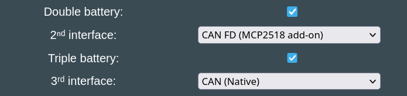
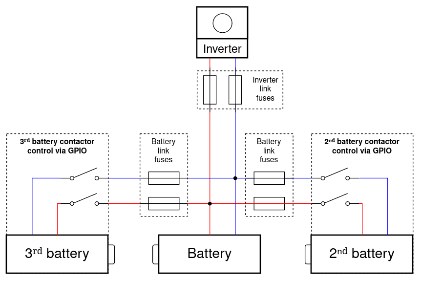
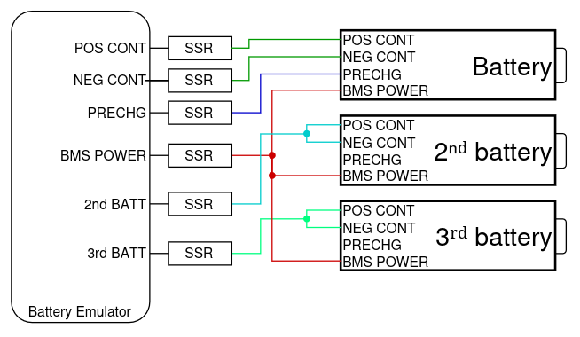
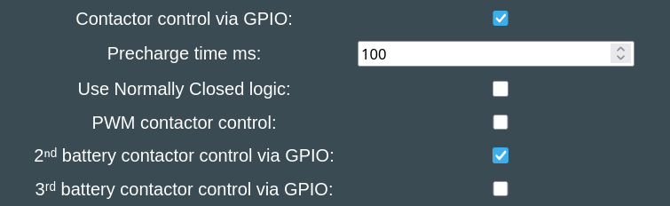

## Hardware requirement

Triple-Battery, much like [Double Battery](battery_2x.md), requires a dedicated CAN channel for each battery.

At the moment the following 3-CAN boards are compatible:

- [LilyGo T-2CAN with MCP2518FD add-on](../../hardware/lilygo_t_2can.md)
    - Connect Battery1 to CAN-A
    - Connect Battery2 to CAN-B
    - Connect Battery3 to MCP2518FD
    - Connect Inverter to Modbus, RS485 or CAN-A (shared with battery1)
- [BECom](../../hardware/becom.md)

### How does parallel operation work?

The same principles apply as described at the [Double Battery](battery_2x.md). Read that page thoroughly, here we only describe differences from the double setup.

## Which batteries are compatible?

Only these integrations offer the "Triple battery" option in the Settings page. The ones with a checkmark have been confirmed working well.

- [CMFA platform (Dacia Spring, Renault K-ZE)](../../battery/dacia_spring_renault_k_ze.md)
- [Nissan LEAF / e-NV200 24/30/40/62kWh](../../battery/nissan_leaf_e_nv200.md) ✅
- [Relion LV](../../battery/relion_lv.md)
- [Stellantis ECMP](../../battery/stellantis_ecmp_citroen_ds_opel_peugeot.md)
- [Fake battery for testing purposes](../../battery/fake_battery.md) (no hardware needed, useful for trying out a triple setup)

All of these are also compatible with [Double Battery](battery_2x.md). 

## GPIO controlled contactors

Connect the high voltage lines like in this diagram. Remember to place fuses both between the Inverter and packs, and the interconnect between the packs.

If your batteries use GPIO-controlled contactors, you use these to attach the second battery to the DC link. Secondary and third battery don't use precharge (leave the precharge relay unconnected), and you can switch both positive and negative at the same time, from the same SSR. No need to add a secondary contactor:

Enable **2ⁿᵈ battery contactor control via GPIO:** and **3ʳᵈ battery contactor control via GPIO:** in the Settings page. When the second and third battery voltage match the main battery the extra contactors will engage and combine them into one large one. After the main battery is started, the system will automatically close the interconnect contactors for the second battery, if it's within 1.5V of the main battery. After that next step is to connect the third battery with the same logic.

This will start with connecting battery 1, then once voltages match, battery 2 and battery 3 join the DC link when their voltages are close enough to the first battery.

Check out the pinout table for each board, to see which pin is defined to actuate the extra contactor set.

To control the second battery if it only has CAN activated contactors, you need to an additional GPIO controlled contactor in series with it.
