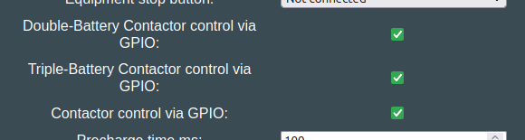

## Hardware requirement

Triple-Battery, much like Double-Battery, requires a dedicated CAN channel for each battery.

At the moment the following 3-CAN boards are supported:

- [LilyGo T-2CAN with MCP2518FD add-on](../../hardware/lilygo_t_2can.md)
    - Connect Battery1 to CAN-A
    - Connect Battery2 to CAN-B
    - Connect Battery3 to MCP2518FD
    - Connect Inverter to Modbus, RS485 or CAN-A (shared with battery1)
- [BECom](../../hardware/becom.md)

## Supported integrations

The list below is generated from `battery_supports_triple()` in `Software/src/battery/BATTERIES.cpp`. Only these integrations offer the "Triple battery" option in the Settings page.

- [CMFA platform (Dacia Spring, Renault K-ZE)](../../battery/dacia_spring_renault_k_ze.md)
- [Nissan LEAF / e-NV200 24/30/40/62kWh](../../battery/nissan_leaf_e_nv200.md) ✅
- [Relion LV](../../battery/relion_lv.md)
- [Stellantis ECMP](../../battery/stellantis_ecmp_citroen_ds_opel_peugeot.md)
- [Fake battery for testing purposes](../../battery/fake_battery.md) (no hardware needed, useful for trying out a triple setup)

All of these also support [Double Battery](battery_2x.md). The same rules apply as for double operation: identical model and size, packs as close as possible in state of health, parallel connection only.

## GPIO controlled contactors

For batteries that require externally controlled contactors, you can automate this by enabling:

- Battery1 - Contactor control via GPIO: ✅
- Battery2 - Double-Battery Contactor control via GPIO: ✅
- Battery3 - Triple-Battery Contactor control via GPIO: ✅

{ width="580" height="155" }

This will start with connecting battery1, then once voltages match, battery2 and battery3 joins the DC link when voltages are close enough to first battery.

See the HAL pin definitions for your hardware, to see which pin actuates the extra contactor set.
