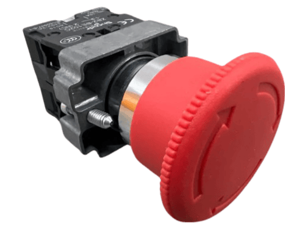
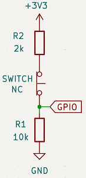

## What is Equipment Stop?

**Equipment Stop** is a critical safety feature that immediately pauses all operations and sets maximum charge and discharge values to zero. Once current reaches zero, the battery contactors are opened immediately — interrupting all high-voltage connections. If current does not reach zero, the contactors are opened unconditionally after 7 seconds regardless.

!!! warning "CAUTION"
    Equipment stop should not be confused with Emergency stop. Equipment performs a graceful stop (which can fail), while an emergency stop button cuts power to the system. If you need more safety than an equipment stop button can offer, consider wiring an emergency stop button instead.

[IP67 1NO1NC Stop Switch](https://vi.aliexpress.com/item/1005008119829541.html)

[Resistor kit](https://vi.aliexpress.com/item/1005006699173023.html)

## How (hardware)
Equipment stop can be added via a Normally Closed (NC) latching switch. This is how most equipment/emergency stop buttons work.

### LilyGo board
Connect the Equipment stop button to the GPIO pins on the board.

- GPIO Pin35 - Switch NC
- Any VDD pin - Switch NC

!!! note "NOTE"
    There are not many free GPIO pins on the LilyGo board. The Pin35 might already be in use if you use some other optional functionality. If a collision happens, you can check the `Battery-Emulator/Software/src/devboard/hal/hw_lilygo.h` for free pins and remap.

### Stark CMR

If you're using Stark CMR v2 you do not need resistors as it has an isolated signal input which can be used with 3.3VDC, 5VDC or 12VDC. 5VDC is preferred.  
Connect 5VDC to one side of the NC E-stop and the other side of the E-stop to SIG IN. Then connect SIG GND to GND.

Stark CMR v1 does not have a dedicated Signal input, use the resistor method as with the lilygo.

- GPIO Pin2 - Switch NC
- VDC pin - Switch NC

**External Pull Resistors for Equipment Stop Button**

In our system, we use external pull resistors to ensure stable and reliable readings from the equipment stop button. Specifically, we use a 2kΩ resistor between the switch and VCC (3.3V) and a 10kΩ resistor between the GPIO pin and GND. This configuration creates a pull-down circuit, which stabilizes the signal and prevents floating values when the button is not pressed.

- The **2kΩ resistor** ensures that when the button is in its **normal (released) state** (NC circuit closed), the GPIO pin is pulled to a reliable high signal (3.3V) without excessive current flow.
- The **10kΩ pull-down resistor** ensures that when the button is **pressed** (NC circuit open), the GPIO pin is pulled to ground, preventing it from floating and avoiding false triggers.

!!! warning "Important"
    Users must add these external resistors to their setup to ensure proper functionality of the button. Without these resistors, the GPIO pin may experience unstable readings or false triggers.

## How (software)

### Enable equipment stop

To enable the Equipment Stop Button functionality, go to the Webserver, Settings page and scroll down to the Hardware configuration.

Set the Switch Behavior to either latching or momentary, depending on the type of button you are using.

**LATCHING_SWITCH**: A normally closed (NC) latching switch. When the switch is pressed, it activates the equipment stop and keeps the stop active as long as the physical switch remains in the pressed position. The stop will only deactivate when the switch is manually returned to its normal (closed) state.

**MOMENTARY_SWITCH**: A normally closed (NC) push switch. A short press activates the equipment stop. To deactivate, **press and hold the button for 15 seconds**. This mode keeps the stop state persistent between reboots.

**Internal Debounce Module**

We have also implemented an internal software debounce module for handling button inputs more reliably, preventing false triggers caused by mechanical noise. 

## Why

The **Equipment Stop** feature was developed to enhance the overall safety and control of the equipment. It provides users with a reliable method to **halt operations** when needed, ensuring that the system can be effectively managed during both routine use and unexpected situations.

This feature is essential for maintaining operational integrity, as it opens the battery contactors controlled by the emulator, interrupting high-voltage connections and mitigating potential hazards. Additionally, it signals a pause in power usage by setting both the maximum and minimum charge values to zero, thereby preventing any unintended operation of the equipment.

Overall, the development of the **Equipment Stop** functionality reflects our commitment to providing users with a comprehensive safety mechanism that promotes responsible equipment management and ensures the reliability of the system.
