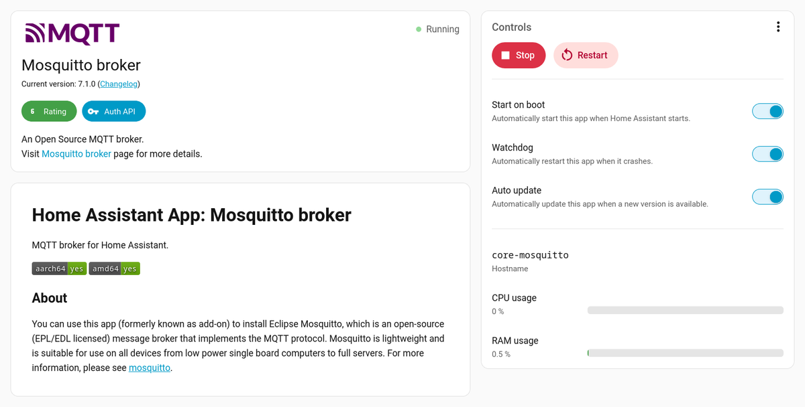
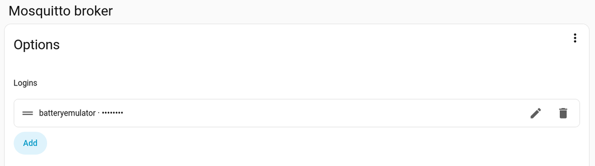
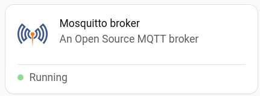
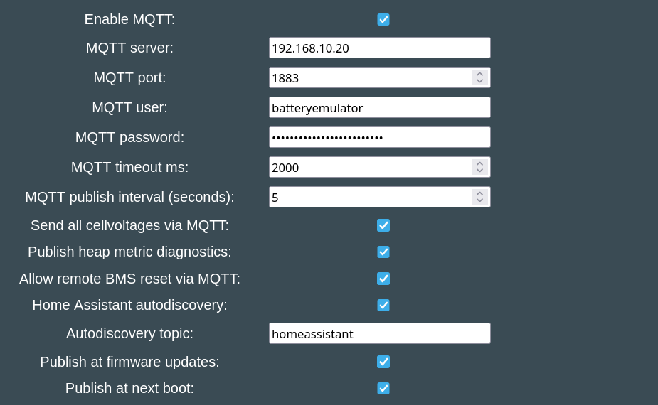
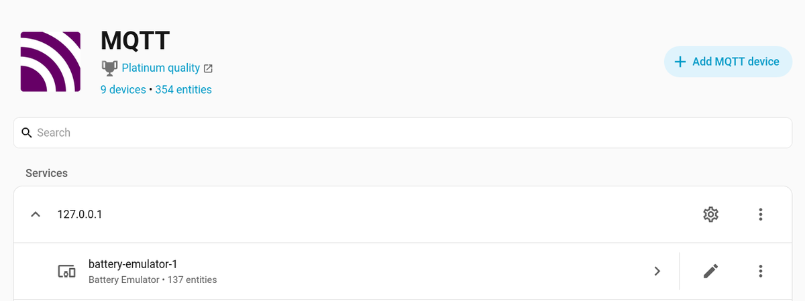
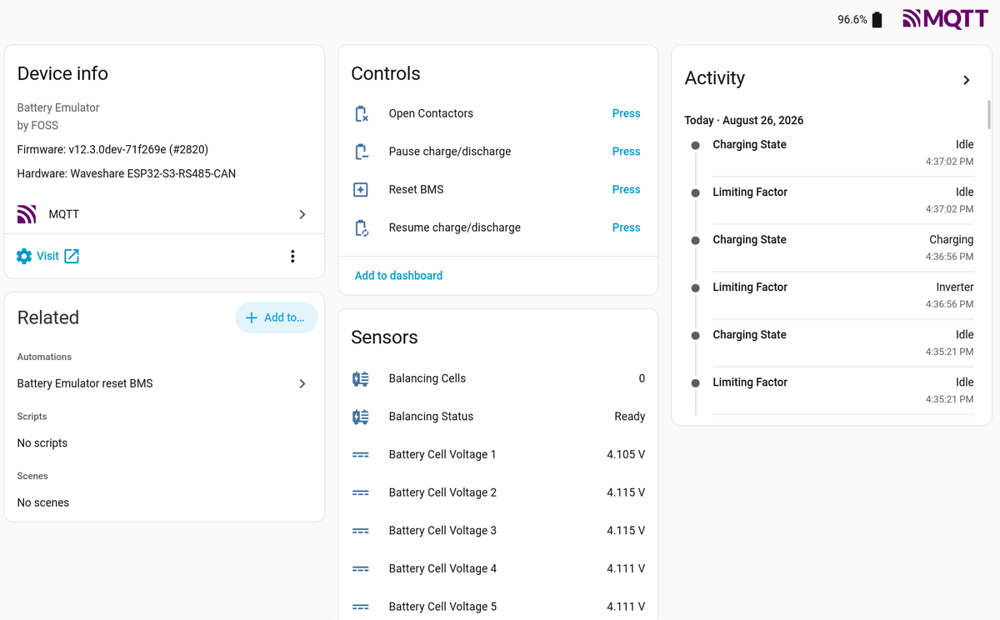
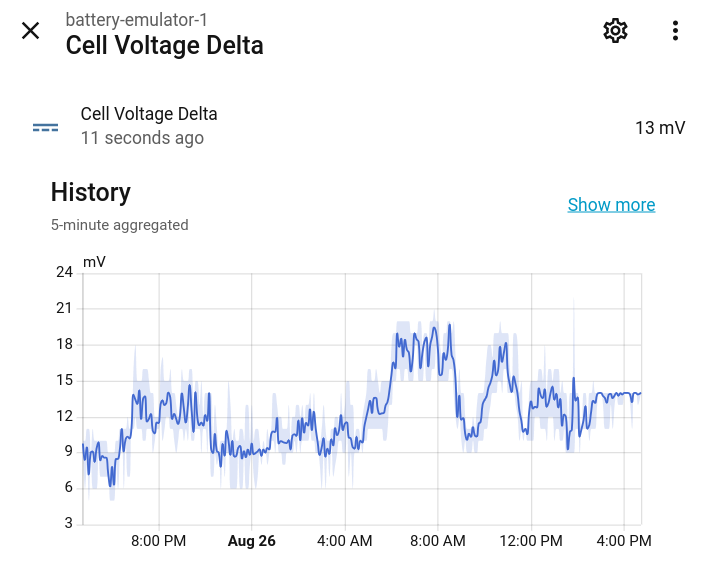
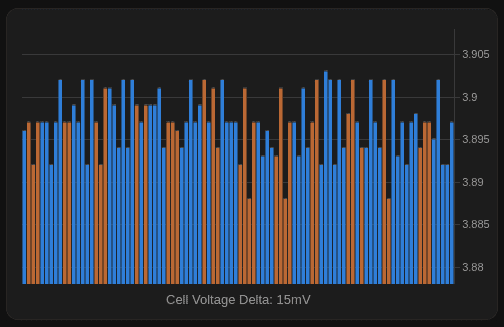
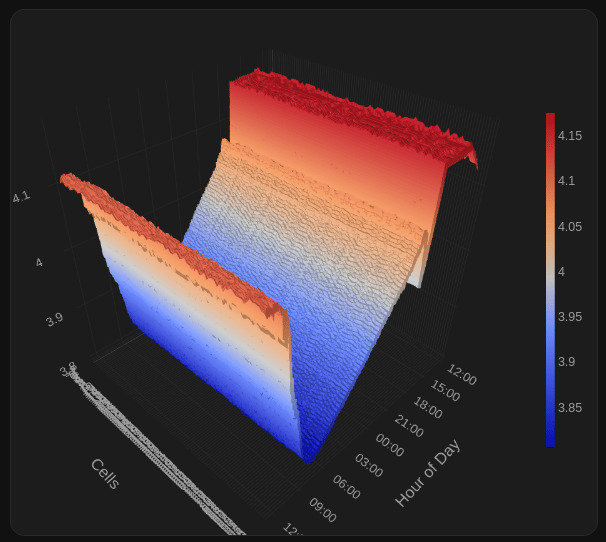

This page walks through setting up [Home Assistant](https://www.home-assistant.io/) with an MQTT broker so that the Battery Emulator shows up as a device with all of its sensors, buttons and events - without any manual YAML. This will give you the possibility to do longer term monitoring and analysis of how your battery pack performs in your specific environment.

Home Assistant supports integrations for many other components that you may use with Battery Emulator, like inverters, smart meters, EV chargers, etc. You can not only organize and display data together from all these sources of information, but also automate them together so your system can become more efficient.

Only the parts that are specific to the Battery Emulator are described in detail here. For everything else, follow the official Home Assistant documentation, which is linked at each step and is always up to date with the current Home Assistant version.

!!! tip "TIP"
    The examples below use `battery-emulator-a1b2` as a stand-in for your device's hostname (`a1b2` being the last two bytes of its MAC address). Replace it with the hostname of your own Battery Emulator device - see [MQTT](mqtt.md).

Before you start, the Battery Emulator should already be flashed and joined to your home network, and its [Webserver](webserver_guide.md) should be reachable from a browser.

## 1. Install Home Assistant

Follow the official [installation guide](https://www.home-assistant.io/installation/) and pick the method that suits your hardware. Choose your hardware by keeping in mind that Home Assistant needs to run 24/7 to gather data in real time from the peripherals you connect to it, including Battery Emulator. Think of connecting it to a UPS source if possible.

!!! tip "TIP"
    You can use any old computer like a refurbished laptop to run Home Assistant. Just double-check its bios settings that it's not going to suspend/turn off after a while.

!!! note "NOTE"
    If you want to use the built-in Mosquitto broker described below, install **Home Assistant OS** or a **Supervised** installation - those are the ones that support apps (add-ons). With Home Assistant Container or Core you have to run a broker yourself (a separate Mosquitto container, or an existing broker elsewhere on your LAN); everything on the Battery Emulator side stays exactly the same, only the broker address changes.

## 2. Give Home Assistant a fixed IP address

**Strongly recommended.** The Battery Emulator stores the broker address as a fixed string in its settings, and does not rediscover the broker on its own. If Home Assistant gets a new address from your DHCP server (after a reboot, a lease expiry, or a router restart), the emulator keeps knocking on the old address, all Home Assistant entities go unavailable, and the only fix is to edit the **MQTT server** field on the emulator by hand and rebooting it.

Two ways to do this, either is fine:

- **DHCP reservation in your router** - reserve an address for the Home Assistant machine's MAC address. Works with every installation type and keeps all address management in one place. This is the simpler option for most users who use the same network device as router and access point.
- **Static IP in Home Assistant** - on Home Assistant OS, go to **Settings** → **System** → **Network**, expand **IPv4** and switch from DHCP to Static. Just make sure you choose an address which falls outside your router's DHCP range.

Use that address in the emulator's **MQTT server** field in step 6. A plain IP address is preferred over a hostname: `homeassistant.local` and other mDNS names may not reliably be resolvable if your local network runs into other issues.

!!! warning "WARNING"
    Make sure your LAN is **not** on `192.168.4.x`. That range conflicts with the Battery Emulator's built-in Wi-Fi access point, and MQTT will not work whenever you'd decice to turn it on.

## 3. Install the Mosquitto broker app (add-on)

In Home Assistant, go to **Settings** → **Apps** → **Install app**, find **Mosquitto broker**, install it, then enable **Start on boot** and **Watchdog** and start it. The official [Mosquitto broker documentation](https://github.com/home-assistant/addons/blob/master/mosquitto/DOCS.md) covers the app in full.



Two things that matter for the Battery Emulator:

- **Leave port `1883` published** on the app's *Configuration* → *Network* card. The emulator connects from outside Home Assistant, so the port has to be reachable on the LAN. Blanking it out disables the listener and the emulator cannot connect.
- **Use the unencrypted listener.** The emulator's MQTT client is plain TCP - TLS is not implemented - so it always connects to `1883`, never to `8883`.

## 4. Create an MQTT user for the Battery Emulator

The Mosquitto app does **not** accept anonymous connections: every client must log in with a username and password. When you set up the MQTT integration in the next step, Home Assistant generates and stores its own hidden credentials for internal use - those are secret and cannot be reused by the emulator. So the Battery Emulator needs a login of its own.

Open the Mosquitto app's **Configuration** tab and add a login: click on **Add**, add some desired credentials and click on **Add** button to close the popup. The MQTT user should appear in the list.



Alternatively (or to verify that the user has been really added) you can switch the editor to YAML using the 3-dots menu button in the top-right corner and look for something like in the config:

```yaml
logins:
  - username: batteryemulator
    password: your_strong_password_here
```

**Save**, then **restart the app**. Keep these credentials - you type them into the emulator in step 6.

!!! note "TIPS"
    - `homeassistant` and `addons` are reserved usernames and cannot be used.
    - Keep the password to **printable ASCII**, without spaces or quotes: the emulator stores MQTT user and password as printable ASCII, and the value is entered through its web form.
    - Running several Battery Emulators (or other MQTT devices)? Give each one its own login, so a single device's credentials can be changed or restricted later without touching the rest.



As an alternative, the Mosquitto app also authenticates against Home Assistant user accounts (**Settings** → **People** → **Users**, requires *Advanced Mode* on your profile). A broker-local login as shown above is usually the better choice, since it keeps device credentials out of your Home Assistant login system.

## 5. Add the MQTT integration

Go to **Settings** → **Devices & services** → **Add integration** and choose **MQTT**. If Mosquitto is running, it is normally offered as a discovered integration and configures itself in one click. See the [MQTT integration documentation](https://www.home-assistant.io/integrations/mqtt/) for the details.

Relevant for the Battery Emulator:

- **Leave MQTT discovery enabled.** Without it, no entities are created from the emulator's autodiscovery messages.
- **Leave the discovery prefix at `homeassistant`.** That is also the emulator's default. If you change it on one side, you must change it on the other to the exact same value.

## 6. Configure MQTT on the Battery Emulator

Open the emulator's Webserver, go to **Settings**, and tick **Enable MQTT** under the Integration settings - the remaining MQTT fields only appear once that box is ticked. Then fill in:

| Battery Emulator setting | Value |
| ------------------------ | ----- |
| **MQTT server** | The fixed IP address of Home Assistant from step 2 |
| **MQTT port** | `1883` |
| **MQTT user** / **MQTT password** | The login created in step 4 |
| **Home Assistant autodiscovery** | Enabled |
| **Autodiscovery topic** | `homeassistant` (must match the prefix used in step 5) |
| **Publish at firmware updates** | Tick it, so the discovery configs are updated in case of changes coming in firmware updates |
| **Publish at next boot** | Tick it, so the discovery configs are published on the next start |

Everything else can stay at its default. Save the settings and **restart the emulator** - the MQTT client and the autodiscovery configs are set up while it boots.



The full list of settings, published topics, payloads and commands is documented on the [MQTT](mqtt.md) page.

## 7. Result

- On the emulator: the event log shows that MQTT is connected.
- In Home Assistant: go to **Settings** → **Devices & services** → **MQTT** → **devices**. A device named after the emulator's hostname (for example `battery-emulator-a1b2`) should be listed, with its sensors, its buttons and its event entity. Emulator-level entities such as *BMS Status* or *Emulator Uptime* live under the device's **Diagnostic** section. Wait a couple of minutes for all the entities to start getting values.





At your convenience, click **Add to dashboard** link on each card you see here to add these entities to the main dashboard page of the system.

To see some historical data about an entity, just click on its name. It will pop up a card showing the data recorded over the last 24 hours:



### Common problems:

| Symptom | Likely cause |
| ------- | ------------ |
| No device appears in Home Assistant | Autodiscovery not enabled, discovery topic mismatch, or the emulator has not been restarted since ticking **Publish at next boot** |
| Entities exist but are all unavailable | The emulator is not connected to the broker - it publishes `offline` to its `status` topic, and the broker does the same on its behalf about 45 s after a sudden failure |
| Nothing connects, Mosquitto log shows a bad username or password | Credentials mismatch, or the login was added but the Mosquitto app was not restarted |
| It worked, then stopped after a reboot | Home Assistant's IP address changed - see step 2 |
| Values show `unknown` right after a start | Normal: the emulator only publishes values once real data has been received from the battery |

- To watch the raw traffic, open **Settings** → **Devices & services** → **MQTT** → **Configure** and listen to the topic `battery-emulator-a1b2/#`.

## Some extras

### Chart examples

Using the [Plotly Graph Card](https://github.com/dbuezas/lovelace-plotly-graph-card) you can generate much better graphics than Home Assistant's built-in ones. This requires instalation of [HACS](https://hacs.xyz/docs/use/configuration/basic/) because it's not originally built-in Home Assistant, it's a community-developed component for it.

#### 2D cell monitor with balancing info

{ width="504" height="327" }

Add to your Home Assistant `configuration.yaml` a manual MQTT sensor to read all the cell data of the battery into a single sensor's attributes (and a recorder exclusion to save database from load):

```yaml
mqtt:
  sensor:
    - name: "Battery Cells"
      unique_id: battery_emulator_a1b2_cells
      state_topic: "battery_emulator_a1b2/spec_data"
      value_template: "{{ value_json.cell_voltages | count }}"
      json_attributes_topic: "battery-emulator-a1b2/spec_data"
      json_attributes_template: "{{ value_json | tojson }}"
      icon: mdi:battery-high

recorder: # add this to prevent HA database to fill with battery cell data of this sensor
  exclude:
    entities:
      - sensor.battery_emulator_a1b2_cells
```

For double and triple battery setups, create separate sensors pointing at `spec_data_2` and `spec_data_3` topics respectively. Restart Home Assistant after adding this config.

In Lovelace, add a custom card for the battery:

```yaml
type: custom:plotly-graph
raw_plotly_config: true
fn: |-
  $ex {
    vars.a     = hass.states["sensor.battery_emulator_a1b2_cells"]?.attributes || {};
    vars.cells = vars.a.cell_voltages || [];
    vars.bal   = vars.a.cell_balancing || [];
    vars.x = vars.cells.map((_, i) =→ i + 1);
    vars.y = vars.cells;
    vars.colors = vars.cells.map((_, i) =→ vars.bal[i] === true ? "#BA6834" : "#2f7ed8");
    vars.delta = vars.cells.length
      ? (Math.max(...vars.cells) - Math.min(...vars.cells)) * 1000
      : 0;
    vars.ymin = vars.cells.length ? Math.min(...vars.cells) - 0.010 : 0;
    vars.ymax = vars.cells.length ? Math.max(...vars.cells) + 0.005 : 1;
  }
entities:
  - entity: sensor.battery_emulator_a1b2_cells
    type: bar
    x: $ex vars.x
    "y": $ex vars.y
    marker:
      color: $ex vars.colors
    texttemplate: "%{y:.3f}"
    hovertemplate: $ex "Cell %{x}<br→%{y:.3f} V<br→%{customdata}<extra→</extra→"
    customdata: "$ex vars.cells.map((_, i) =→ vars.bal[i] ? \"balancing/pending\" : \"idle\")"
    refresh_interval: 2
layout:
  height: 300
  xaxis:
    showgrid: false
    zeroline: false
    showticklabels: false
    ticks: false
    nticks: 1
    visible: false
  margin:
    t: 10
    l: 15
    r: 45
    b: 35
  annotations:
    - text: →-
        $ex "Cell Voltage Delta: " + (isNaN(vars.delta) ? "--" :
        vars.delta.toFixed(0)) + "mV"
      xref: paper
      yref: paper
      x: 0.5
      "y": -0.02
      xanchor: center
      yanchor: top
      showarrow: false
      font:
        size: 13
        color: "#9e9e9e"
  yaxis:
    side: right
    range:
      - $ex vars.ymin
      - $ex vars.ymax
config:
  displayModeBar: false
  scrollZoom: false

```

#### 3D Cell monitor (in relation with time) for 96 cells

{ width="606" height="542" }

```yaml
type: custom:plotly-graph
raw_plotly_config: true
hours_to_show: 1d
defaults:
  entity:
    internal: true
    filters:
      - resample: 1m
    fn: |
      $ex {
          vars.data.push(ys);
          vars.xs = xs;
       }
fn: $ex vars.data = []
layout:
  height: 380
  margin:
    t: 0
    l: 0
    r: 40
    b: 0
  scene:
    domain:
      x:
        - 0
        - 1
      "y":
        - 0
        - 1
    xaxis:
      title: Hour of Day
      tickformat: "%H:%M"
    yaxis:
      title: Cells
      tickmode: linear
      dtick: 1
    zaxis:
      title: V
    camera:
      center:
        x: 0
        "y": 0
        z: -0.1
config:
  displayModeBar: false
entities:
  - entity: sensor.battery_emulator_a1b2_battery_voltage_cell1
  - entity: sensor.battery_emulator_a1b2_battery_voltage_cell2
  - entity: sensor.battery_emulator_a1b2_battery_voltage_cell3
  - entity: sensor.battery_emulator_a1b2_battery_voltage_cell4
  - entity: sensor.battery_emulator_a1b2_battery_voltage_cell5
  - entity: sensor.battery_emulator_a1b2_battery_voltage_cell6
  - entity: sensor.battery_emulator_a1b2_battery_voltage_cell7
  - entity: sensor.battery_emulator_a1b2_battery_voltage_cell8
  - entity: sensor.battery_emulator_a1b2_battery_voltage_cell9
  - entity: sensor.battery_emulator_a1b2_battery_voltage_cell10
  - entity: sensor.battery_emulator_a1b2_battery_voltage_cell11
  - entity: sensor.battery_emulator_a1b2_battery_voltage_cell12
  - entity: sensor.battery_emulator_a1b2_battery_voltage_cell13
  - entity: sensor.battery_emulator_a1b2_battery_voltage_cell14
  - entity: sensor.battery_emulator_a1b2_battery_voltage_cell15
  - entity: sensor.battery_emulator_a1b2_battery_voltage_cell16
  - entity: sensor.battery_emulator_a1b2_battery_voltage_cell17
  - entity: sensor.battery_emulator_a1b2_battery_voltage_cell18
  - entity: sensor.battery_emulator_a1b2_battery_voltage_cell19
  - entity: sensor.battery_emulator_a1b2_battery_voltage_cell20
  - entity: sensor.battery_emulator_a1b2_battery_voltage_cell21
  - entity: sensor.battery_emulator_a1b2_battery_voltage_cell22
  - entity: sensor.battery_emulator_a1b2_battery_voltage_cell23
  - entity: sensor.battery_emulator_a1b2_battery_voltage_cell24
  - entity: sensor.battery_emulator_a1b2_battery_voltage_cell25
  - entity: sensor.battery_emulator_a1b2_battery_voltage_cell26
  - entity: sensor.battery_emulator_a1b2_battery_voltage_cell27
  - entity: sensor.battery_emulator_a1b2_battery_voltage_cell28
  - entity: sensor.battery_emulator_a1b2_battery_voltage_cell29
  - entity: sensor.battery_emulator_a1b2_battery_voltage_cell30
  - entity: sensor.battery_emulator_a1b2_battery_voltage_cell31
  - entity: sensor.battery_emulator_a1b2_battery_voltage_cell32
  - entity: sensor.battery_emulator_a1b2_battery_voltage_cell33
  - entity: sensor.battery_emulator_a1b2_battery_voltage_cell34
  - entity: sensor.battery_emulator_a1b2_battery_voltage_cell35
  - entity: sensor.battery_emulator_a1b2_battery_voltage_cell36
  - entity: sensor.battery_emulator_a1b2_battery_voltage_cell37
  - entity: sensor.battery_emulator_a1b2_battery_voltage_cell38
  - entity: sensor.battery_emulator_a1b2_battery_voltage_cell39
  - entity: sensor.battery_emulator_a1b2_battery_voltage_cell40
  - entity: sensor.battery_emulator_a1b2_battery_voltage_cell41
  - entity: sensor.battery_emulator_a1b2_battery_voltage_cell42
  - entity: sensor.battery_emulator_a1b2_battery_voltage_cell43
  - entity: sensor.battery_emulator_a1b2_battery_voltage_cell44
  - entity: sensor.battery_emulator_a1b2_battery_voltage_cell45
  - entity: sensor.battery_emulator_a1b2_battery_voltage_cell46
  - entity: sensor.battery_emulator_a1b2_battery_voltage_cell47
  - entity: sensor.battery_emulator_a1b2_battery_voltage_cell48
  - entity: sensor.battery_emulator_a1b2_battery_voltage_cell49
  - entity: sensor.battery_emulator_a1b2_battery_voltage_cell50
  - entity: sensor.battery_emulator_a1b2_battery_voltage_cell51
  - entity: sensor.battery_emulator_a1b2_battery_voltage_cell52
  - entity: sensor.battery_emulator_a1b2_battery_voltage_cell53
  - entity: sensor.battery_emulator_a1b2_battery_voltage_cell54
  - entity: sensor.battery_emulator_a1b2_battery_voltage_cell55
  - entity: sensor.battery_emulator_a1b2_battery_voltage_cell56
  - entity: sensor.battery_emulator_a1b2_battery_voltage_cell57
  - entity: sensor.battery_emulator_a1b2_battery_voltage_cell58
  - entity: sensor.battery_emulator_a1b2_battery_voltage_cell59
  - entity: sensor.battery_emulator_a1b2_battery_voltage_cell60
  - entity: sensor.battery_emulator_a1b2_battery_voltage_cell61
  - entity: sensor.battery_emulator_a1b2_battery_voltage_cell62
  - entity: sensor.battery_emulator_a1b2_battery_voltage_cell63
  - entity: sensor.battery_emulator_a1b2_battery_voltage_cell64
  - entity: sensor.battery_emulator_a1b2_battery_voltage_cell65
  - entity: sensor.battery_emulator_a1b2_battery_voltage_cell66
  - entity: sensor.battery_emulator_a1b2_battery_voltage_cell67
  - entity: sensor.battery_emulator_a1b2_battery_voltage_cell68
  - entity: sensor.battery_emulator_a1b2_battery_voltage_cell69
  - entity: sensor.battery_emulator_a1b2_battery_voltage_cell70
  - entity: sensor.battery_emulator_a1b2_battery_voltage_cell71
  - entity: sensor.battery_emulator_a1b2_battery_voltage_cell72
  - entity: sensor.battery_emulator_a1b2_battery_voltage_cell73
  - entity: sensor.battery_emulator_a1b2_battery_voltage_cell74
  - entity: sensor.battery_emulator_a1b2_battery_voltage_cell75
  - entity: sensor.battery_emulator_a1b2_battery_voltage_cell76
  - entity: sensor.battery_emulator_a1b2_battery_voltage_cell77
  - entity: sensor.battery_emulator_a1b2_battery_voltage_cell78
  - entity: sensor.battery_emulator_a1b2_battery_voltage_cell79
  - entity: sensor.battery_emulator_a1b2_battery_voltage_cell80
  - entity: sensor.battery_emulator_a1b2_battery_voltage_cell81
  - entity: sensor.battery_emulator_a1b2_battery_voltage_cell82
  - entity: sensor.battery_emulator_a1b2_battery_voltage_cell83
  - entity: sensor.battery_emulator_a1b2_battery_voltage_cell84
  - entity: sensor.battery_emulator_a1b2_battery_voltage_cell85
  - entity: sensor.battery_emulator_a1b2_battery_voltage_cell86
  - entity: sensor.battery_emulator_a1b2_battery_voltage_cell87
  - entity: sensor.battery_emulator_a1b2_battery_voltage_cell88
  - entity: sensor.battery_emulator_a1b2_battery_voltage_cell89
  - entity: sensor.battery_emulator_a1b2_battery_voltage_cell90
  - entity: sensor.battery_emulator_a1b2_battery_voltage_cell91
  - entity: sensor.battery_emulator_a1b2_battery_voltage_cell92
  - entity: sensor.battery_emulator_a1b2_battery_voltage_cell93
  - entity: sensor.battery_emulator_a1b2_battery_voltage_cell94
  - entity: sensor.battery_emulator_a1b2_battery_voltage_cell95
  - entity: sensor.battery_emulator_a1b2_battery_voltage_cell96
  - entity: ""
    internal: false
    type: surface
    x: $ex vars.xs
    "y": $ex vars.data.map((_,i)=→i)
    z: $ex vars.data
    colorbar:
      thickness: 7
      len: 0.7
      outlinewidth: 0
      tickfont:
        size: 10
      x: 1
      xpad: 1
      xanchor: left
```

### Pause Charge/Discharge switch (instead of just two buttons)

Create a manually configured template switch which not only will toggle Battery Emulator paused state, but will also reflect this in reality.

```yaml
template:
  - switch:
      - name: Pause Charge/Discharge
        default_entity_id: switch.battery_emulator_a1b2_charge_discharge_paused
        availability: "{{ states('sensor.battery_emulator_a1b2_pause_status') in ['RUNNING', 'RESUMING', 'PAUSED', 'PAUSING'] }}" # Unavailable when the state is unknown or BE is offline
        state: "{{ states('sensor.battery_emulator_a1b2_pause_status') in ['PAUSED', 'PAUSING'] }}" # OFF = running/resuming, ON = paused/pausing — reflects the real state
        icon: mdi:battery-remove
        turn_off:
          - action: mqtt.publish
            data:
              topic: "battery_emulator_a1b2/command/RESUME"
              payload: "PRESS"
        turn_on:
          - action: mqtt.publish
            data:
              topic: "battery_emulator_a1b2/command/PAUSE"
              payload: "PRESS"
```

### [SET_LIMITS](mqtt.md#set_limits) user interface

Use an input number helper to select the **limit timeout**, and create two MQTT number entities to select the desired current limits. Always set the desired timeout first, and change the current values after.

```yaml
input_number:
  - be_limit_timeout:
      name: BE limit timeout
      min: 1
      max: 86400
      step: 1
      icon: mdi:camera-timer
      mode: box
      unit_of_measurement: 's'

mqtt:
  - number:
      - name: "BE charge current limit"
        unique_id: be_charge_current_limit
        command_topic: "battery_emulator_a1b2/command/SET_LIMITS"
        availability_topic: "battery_emulator_a1b2/status"
        payload_available: "online"
        payload_not_available: "offline"
        device:
          identifiers: ["battery_emulator_a1b2"]
        min: 0
        max: 30          # set to your battery/inverter max
        step: 0.5
        unit_of_measurement: "A"
        icon: mdi:battery-arrow-up
        retain: false
        command_template: →-
          {"max_charge": {{ ((value | float(0)) * 10) | round(0) | int }},
           "max_discharge": {{ ((states('number.be_discharge_current_limit') | float(0)) * 10) | round(0) | int }},
           "timeout": {{ states('input_number.be_limit_timeout') | float(30) | int }}}

  - number:
      - name: "BE discharge current limit"
        unique_id: be_discharge_current_limit
        command_topic: "battery_emulator_a1b2/command/SET_LIMITS"
        availability_topic: "battery_emulator_a1b2/status"
        payload_available: "online"
        payload_not_available: "offline"
        device:
          identifiers: ["battery_emulator_a1b2"]
        min: 0
        max: 30
        step: 0.5
        unit_of_measurement: "A"
        icon: mdi:battery-arrow-down
        retain: false
        command_template: →-
          {"max_charge": {{ ((states('number.be_charge_current_limit') | float(0)) * 10) | round(0) | int }},
           "max_discharge": {{ ((value | float(0)) * 10) | round(0) | int }},
           "timeout": {{ states('input_number.be_limit_timeout') | float(30) | int }}}
```


## References

- [Battery Emulator MQTT](mqtt.md) for the complete topic, payload, discovery and command reference, including [remote commands](mqtt.md#subscriptions) such as pause, resume and charge limits.
- [Running multiple Battery Emulators on one broker](mqtt.md#running-multiple-battery-emulators-on-one-broker) works out of the box
- [Home Assistant installation](https://www.home-assistant.io/installation/) documentation
- [Home Assistant Community Store](https://www.hacs.xyz/) (HACS) to add third party components to Home Assistant
- [Mosquitto broker](https://github.com/home-assistant/addons/blob/master/mosquitto/DOCS.md) app documentation
- [Home Assistant MQTT integration](https://www.home-assistant.io/integrations/mqtt/) documentation
- [Home Assistant OS advamced network configuration](https://developers.home-assistant.io/docs/operating-system/network/) for CLI/USB options
