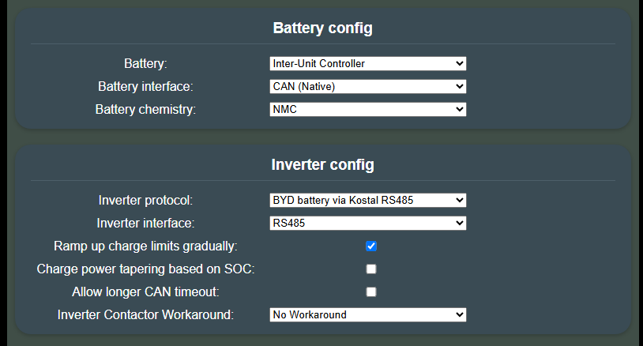
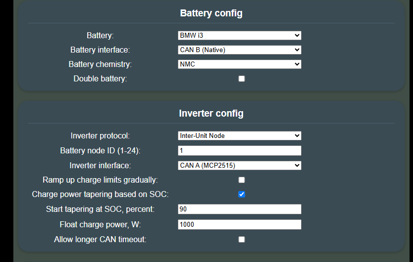
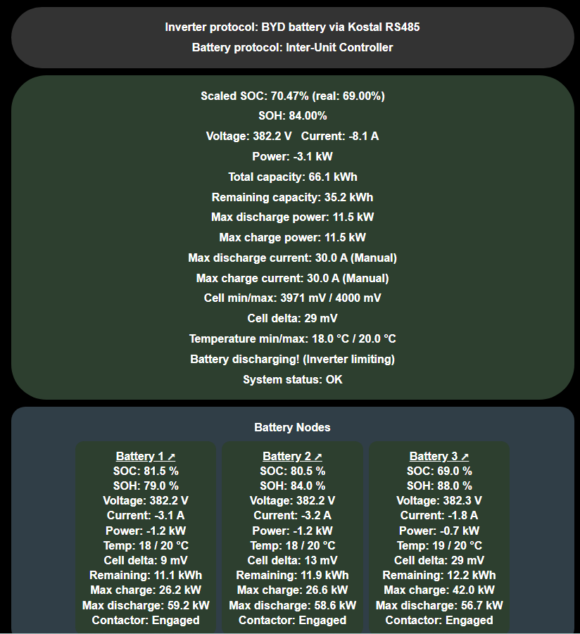
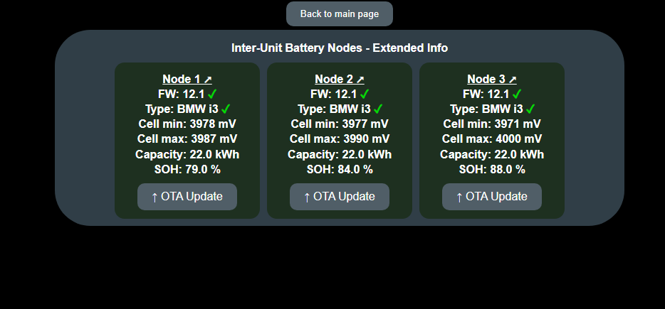
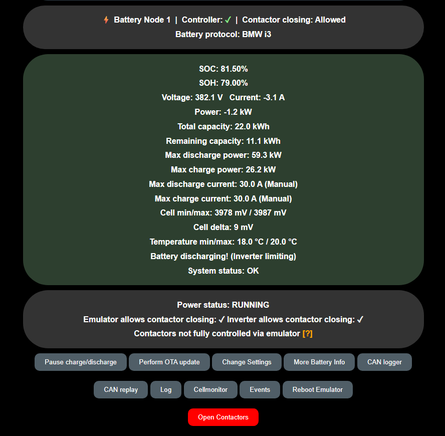

### What is this feature?

Inter-Unit lets you run **up to 24 battery packs in parallel** by giving each pack its own Battery-Emulator board. One extra board, the **Controller**, talks to the inverter. The other boards, the **Battery Nodes**, each talk to one battery. They connect over a shared CAN bus between the boards.

The inverter sees a single large battery, as with [Double Battery](battery_2x.md) and [Triple Battery](battery_3x.md).

| Role | Talks to | Does |
|---|---|---|
| **Controller** | The inverter, and all nodes over the inter-unit CAN bus | Combines the data from all nodes into one virtual battery for the inverter. Decides when each node may close its contactors. |
| **Battery Node** | One battery, and the controller over the inter-unit CAN bus | Runs the normal battery integration for its pack. Sends that pack's data to the controller. Closes and opens its contactors only when the controller allows it. |

#### When to use this instead of Double/Triple Battery

| | Double / Triple Battery | Inter-Unit |
|---|---|---|
| Max packs | 2 / 3 | 24 |
| Boards | One board | One controller + one board per pack |
| CAN channels per board | One per battery, plus the inverter | Two per board (see [Hardware](#hardware-requirement)) |
| Packs physically far apart | Every battery CAN cable runs to the one board | Each node sits next to its pack. Only the inter-unit CAN bus runs between them. |

If two or three packs are enough and they sit next to each other, Double/Triple Battery is simpler. Use Inter-Unit when you need more packs, or when one board per pack is easier to wire.

!!! info "IMPORTANT"
    The same rules as for [Double Battery](battery_2x.md#how-does-parallel-operation-work) apply. Packs are connected **in parallel only**. They must be the same model and size, and as close as possible in state of health. Read that page first; this page only describes what is different.

!!! danger "CAUTION"
    Each pack you add increases the energy that can be released in a fault. Connecting packs at different voltages dumps very large currents between them. Fuse every pack separately and fuse the shared DC link. Never connect packs in series.

---

## Hardware requirement

!!! warning "Not available on LilyGo T-CAN485 or ESP32 DevKit"
    These boards have too little flash for this feature, so their firmware does not include it. The **Inter-Unit Controller** battery type and the **Inter-Unit Node** inverter protocol don't appear in their Settings page.

    Use one of these boards for the controller and for every node: [LilyGo T-2CAN](../../hardware/lilygo_t_2can.md), [Stark CMR](../../hardware/stark_cmr.md), [BECom](../../hardware/becom.md), [Waveshare ESP32-S3 RS485 CAN](../../hardware/waveshare_esp32_s3_rs485_can.md) or [DFRobot Edge101](../../hardware/dfrobot_edge101.md).

```
        ┌───────────┐
        │  Inverter │
        └─────┬─────┘
              │ CAN / RS485 / Modbus
        ┌─────┴──────┐
        │ CONTROLLER │
        └─────┬──────┘
              │ (Controller's battery interface)
   ═══════════╪═══════════════════╪═══════════════ ...  Inter-unit CAN bus, 500 kbps
              │                   │                     120 Ω at both ends
              │ (Node's inverter interface)
        ┌─────┴──────┐      ┌─────┴──────┐
        │   NODE 1   │      │   NODE 2   │   ... up to NODE 24
        └─────┬──────┘      └─────┬──────┘
              │ CAN               │ CAN
        ┌─────┴─────┐       ┌─────┴─────┐
        │ Battery 1 │       │ Battery 2 │
        └───────────┘       └───────────┘
```

* **Controller:** the inverter connects to the controller's *inverter interface* as usual. The inter-unit bus connects to the controller's *battery interface*. If your inverter uses CAN, the controller needs two CAN channels. If it uses RS485/Modbus, one CAN channel is enough.
* **Each node:** the battery connects to the node's *battery interface* as usual. The inter-unit bus connects to the node's *inverter interface*. A node therefore needs two CAN channels. A [LilyGo T-2CAN](../../hardware/lilygo_t_2can.md) has two channels built in, and a [Stark CMR](../../hardware/stark_cmr.md) has CAN and CAN-FD.
* **Inter-unit CAN bus:** one shared bus at 500 kbps. Daisy-chain it from board to board. Terminate it with 120 Ω at **both physical ends** and nowhere else. Connect the grounds of all boards together. See [CAN wiring practices](../can_related/can_wiring_practices_and_troubleshooting.md).

!!! note "NOTE"
    Nothing else may share the inter-unit bus. The protocol uses CAN IDs `0x110`–`0x285` and `0x300`–`0x318`. A battery or inverter on the same bus would collide with those IDs.

### High voltage and contactors

Wire the high voltage side like a [Double Battery](battery_2x.md#high-voltage-connection-diagram) setup, with one branch per pack. Each node controls its own pack's contactors exactly as a single Battery-Emulator would, through the battery's own CAN-controlled contactors or through [GPIO contactor control](contactor_control_via_gpio_pins.md).

The difference is *when* a node is allowed to close: the node only closes once the controller says so. The controller only says so when that pack's voltage matches the packs already on the DC link (see [How packs join the DC link](#how-packs-join-the-dc-link)).

The advice on [CAN-controlled contactors](battery_2x.md#can-controlled-contactors) from the Double Battery page applies here too. A pack that joins later closes onto a live bus. Some BMSes don't accept that. If you are not sure about your battery, put an extra GPIO-controlled contactor in series with it.

---

## Which batteries are compatible?

A node runs the normal integration for its battery, so in principle any supported battery can be used. All nodes must use the **same battery type**, and the controller blocks a node that reports a different one.

The battery integration must respect the "inverter allows contactor closing" signal, because that is how the controller tells each node when to close and open its contactors. Each node can only have one pack (see [Each Battery Node](#each-battery-node)).

Confirmed working:

- [BMW i3](../../battery/bmw_i3.md) ✅ (including offline balancing, see below)

If you run another battery type successfully, please add it to this list.

---

## Taking it into use

!!! warning "Flash every board with the same firmware version"
    The controller checks each node's firmware version. A node with a different version is not allowed to close its contactors. Update the controller and all nodes together. Older firmware versions of the inter-unit protocol cannot talk to newer ones.

### Controller

In the Settings page:

1. **Battery:** `Inter-Unit Controller`
2. **Battery interface:** the CAN channel that is wired to the inter-unit bus
3. **Inverter protocol / Inverter interface:** your inverter, as usual

Example: the controller uses its native CAN for the inter-unit bus, and talks to a Kostal inverter over RS485.



### Each Battery Node

In the Settings page:

1. **Battery / Battery interface:** your battery, as usual. Leave **Double battery** unchecked (see the warning below).
2. **Inverter protocol:** `Inter-Unit Node`
3. **Battery node ID (1-24):** a number that is **unique** on the bus. Two nodes with the same ID will corrupt each other's data.
4. **Inverter interface:** the CAN channel that is wired to the inter-unit bus

Example: a LilyGo T-2CAN node with the BMW i3 on CAN B and the inter-unit bus on CAN A.



!!! warning "Double and Triple Battery are not supported on a node"
    Each node must have exactly **one** pack. A node only sends its first pack's data to the controller, not the combined data of both or all three packs. With Double or Triple Battery enabled, the controller would only see the first pack's capacity, current and charge/discharge limits, and could allow more power than the other packs can handle.

    Supporting this needs a change in the firmware (the node would have to send the combined data). Until that is done, use more nodes instead.

Save and reboot each board. Configure WiFi on the nodes as well. They then report their IP address to the controller, and the controller's web page links to each node's own web page (see [Web interface](#web-interface)).

---

## How it works

### Startup sequence

1. The controller sends a heartbeat on the inter-unit bus every second. Every node replies with its pack's data. To avoid collisions, node *N* waits *N* × 5 ms before replying.
2. When the first node comes online, the controller starts a **20 second grace period**. During this time **all contactors stay open**, so every node has time to report its voltage.
3. When the grace period ends:
    * If all online packs are within **1.5 V** of each other, they all close together.
    * Otherwise the first node becomes the reference and closes. The others join one by one as their voltage comes close enough (see below).

A node that has not yet sent its firmware version and battery type is never allowed to close.

### How packs join the DC link

A pack that is not yet connected must match the voltage of the packs already on the DC link:

* **Direct join:** the difference is **1.5 V or less** for **10 seconds**. This is the normal case, for example after a short disconnect.
* **Pre-join:** the difference is between 1.5 V and 1.8 V *and* the inverter is moving more than 300 W. The charge or discharge current will pull the packs closer together, so the controller waits for that. It allows the pack to close once the difference has been small enough for 2 seconds:
    * **Charging:** 0.5 V or less
    * **Discharging:** 0.7 V or less, and only if the joining pack is not lower than the bus

    If the load stays below 300 W for 30 seconds, pre-join is cancelled and the pack waits for a direct join. The pack's card on the controller shows **Prejoin** in orange while this is active.

If the difference is larger than 1.8 V, or the inverter is idle, the pack stays out until the voltages match. A pack that is already connected is **not** disconnected just because its voltage drifts.

### How the packs become one virtual battery

Only packs whose contactors are **actually closed** count. A pack that is allowed to close but has not closed yet is left out.

| Value | How the packs are combined |
|---|---|
| **Total / remaining capacity** | Sum |
| **Current** | Sum |
| **Voltage** | The first pack's measurement (they share one bus) |
| **Max charge / discharge power** | The **lowest** pack's limit × the number of connected packs |
| **SOC** | The emptiest pack. When the fullest pack passes 95 %, the value blends smoothly towards the fullest, so the inverter sees a gradual rise to 100 % |
| **State of health** | Average of all packs, rounded to whole percent |
| **Temperature min / max** | Lowest and highest of all packs |
| **Cell voltage min / max** | Lowest and highest of all packs |
| **Charge / discharge voltage limits** | Lowest ceiling and highest floor of all packs |

!!! info "One pack can stop the whole installation"
    If any connected pack reports a charge or discharge limit of **0**, the inverter is told 0 for the whole installation. Current divides between parallel packs according to their internal resistance. It cannot be steered away from one pack, so this is the only safe option.

#### Offline balancing (BMW i3)

When a node's pack starts offline balancing, the node tells the controller. The controller then sets charge and discharge power to 0 until that pack has opened its contactors. That way the pack disconnects with no current flowing. The remaining packs then continue on their own. The controller blocks the balancing pack from reconnecting for 50 seconds, and the node card shows **Offline Balancing**.

---

## Safety behaviour

| Situation | What happens | Event |
|---|---|---|
| Node stops responding for 60 s | Node marked offline, its contactors are not allowed to close | `EVENT_BATTERY_NODE_MISSING` |
| Node keeps sending, but its data stops changing for 3 s (e.g. node software hung) | Node's contactors are not allowed to close until data changes again | `EVENT_BATTERY_NODE_STATUS_STALE` |
| Node reports a BMS fault, battery CAN timeout or contactor failure | Node's contactors are opened | `EVENT_BATTERY_NODE_FAULT` |
| Node reports cell over/under-voltage or over-temperature | Warning only, contactors stay as they are | `EVENT_BATTERY_NODE_WARNING` |
| Node has a different firmware version or battery type | A node that is not yet connected is not allowed to close. A pack that is already connected is not disconnected. | `EVENT_BATTERY_NODE_IDENT_MISMATCH` |
| Node has heard no heartbeat from the controller for 60 s | Node opens its contactors | `EVENT_CAN_CONTROLLER_MISSING` (on the node) |
| Equipment stop on the controller | All nodes are told to open | |

All events clear themselves when the condition goes away. Every frame on the inter-unit bus also carries a checksum. A corrupted frame is ignored and never makes anything less safe: a node that only sends corrupted frames ends up offline.

---

## Web interface

### On the controller

The main page shows the combined battery, which is what the inverter sees. Below it, the **Battery Nodes** section has one card per node. Each card shows SOC, SOH, voltage, current, power, temperature, cell delta, remaining capacity, charge/discharge limits and contactor state (**Engaged**, **Prejoin** or **Open**). If the node has reported its IP address, its name is shown as a link (**Battery 1 ↗**, **Battery 2 ↗** …). Click it to open that node's own web page in a new tab, for example to see its events, cell monitor or log. A node without WiFi is shown without a link.

When a node reports a problem, its card shows **⚠ FAULT** in red (an error, so its contactors are blocked) or **⚠ WARNING** in orange (advisory only). If the node has reported its IP address, the label is a link that opens the **Events** page on that node, so you go straight to the cause.



The colour of the Battery Nodes section shows the overall state:

| Colour | Meaning |
|---|---|
| Blue-grey | Normal operation |
| Yellow | Warning on at least one node |
| Red | Error on at least one node, so its contactors are blocked |
| Blue | Firmware update (OTA) in progress |

**More Battery Info** on the controller shows each node's firmware version, battery type and cell voltages. A green ✓ means the node matches the controller; a red ✗ means it is blocked by the firmware or battery type check. The **OTA Update** button opens that node's own firmware update page, so you can update every node from one place.



### On each node

The top of the main page shows the node ID, whether the controller is online, and whether the controller currently allows contactor closing. Below that, the node shows its own battery as a normal single-battery setup would.



---

## Troubleshooting

* **Node never shows up on the controller.** Check the inter-unit bus wiring and termination. Check that the node's *inverter interface* and the controller's *battery interface* point at the CAN channel that is actually wired. Check that no two nodes share a node ID.
* **A node card shows ⚠ FAULT or ⚠ WARNING.** Click the label to open that node's Events page and see what its battery is reporting.
* **Node is online but its contactors never close.** Look at the events page on the controller. The usual causes are a voltage difference that is too large (charge or discharge the packs closer together first), an `IDENT_MISMATCH` (firmware or battery type differs), or a fault flag from that node's battery.
* **All charge/discharge power is 0.** One of the connected packs is reporting a limit of 0, for example because it is full, empty, or starting offline balancing. Check each node card.

---

## Protocol reference

The message layouts, CAN IDs, timing and checksum are documented for developers in [INTER-UNIT-PROTOCOL-README.md](https://github.com/dalathegreat/Battery-Emulator/blob/main/INTER-UNIT-PROTOCOL-README.md) in the Battery-Emulator repository.
